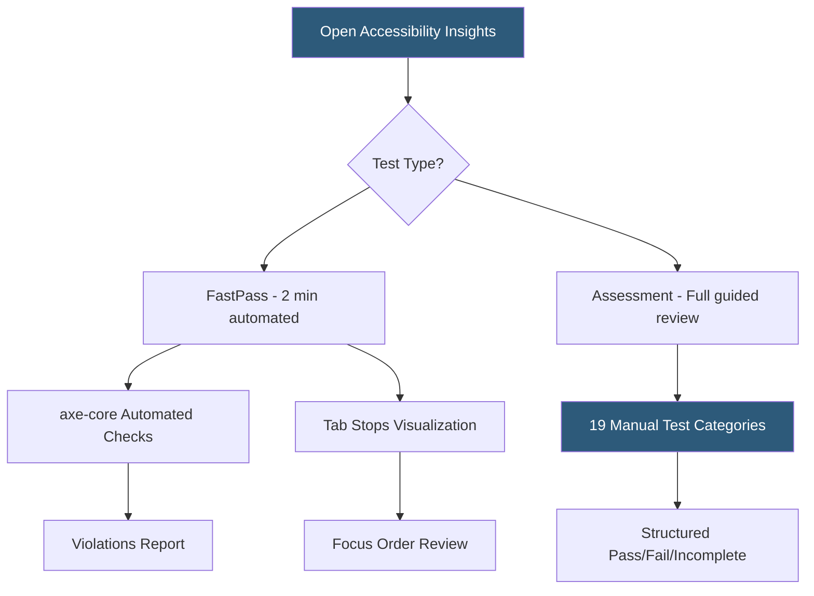

**Category:** Accessibility & Performance Tools
**Difficulty:** Intermediate
**Reading time:** 6 min read

---

Accessibility Insights is a free, open-source accessibility testing toolset from Microsoft that guides developers through both automated and manual accessibility testing workflows. Unlike tools that only run automated scans, it provides structured guided assessments for keyboard navigation, screen reader compatibility, and color contrast — the issues automated tools cannot catch.

- **FastPass** — Accessibility Insights' automated scan that runs axe-based checks and identifies definitive violations in under 2 minutes
- **Assessment** — a structured manual testing guide that walks testers through 19 requirement categories with step-by-step instructions
- **Tab Stops Visualization** — Accessibility Insights draws the keyboard focus order on the page as an overlay, making it visual rather than requiring mental tracking
- **Color Contrast Analyzer** — an eyedropper tool for sampling foreground and background colors anywhere on screen to calculate contrast ratios
- **Focus Testing** — guided process for verifying that focus indicators are visible, focus order is logical, and focus doesn't get trapped
- **Web vs Windows App** — Accessibility Insights comes in two flavors: a Chrome browser extension for web content, and a Windows desktop app for native applications

Accessibility Insights for Web is a Chrome extension. After installing and navigating to a page, you launch FastPass, which runs axe-core automated rules (same engine as axe DevTools) and immediately overlays the results on the page. But FastPass also includes "Tab Stops" — click the Tab Stops button and it draws numbered circles showing where keyboard focus lands in sequence, with arrows indicating the focus order. This makes it instantly obvious when focus jumps unexpectedly or gets trapped in a widget.

The Assessment mode is a comprehensive guided testing protocol covering all WCAG 2.1 AA success criteria. For each category (keyboard navigation, focus traps, images, forms, time-based media, etc.), the tool provides step-by-step instructions, explains what to test and why, and asks you to mark each item as Pass, Fail, or Not Applicable. Failures prompt you to log the element and describe the issue.

The completed Assessment exports as an HTML or JSON report documenting every tested requirement with findings. This structured report satisfies legal documentation requirements for accessibility compliance programs.

The Windows app targets native applications: it connects to running Windows apps and uses the UI Automation API to test controls, enumerated elements, and focus behavior in native UIs.

Accessibility Insights is open-source (MIT licensed) and developed by Microsoft in collaboration with the web accessibility community.

- Full WCAG 2.1 AA assessment — structured documentation for compliance programs or legal risk mitigation
- Developer keyboard testing — Tab Stops view instantly shows focus order problems during development
- Screen reader preparation — Assessment guides through all elements a screen reader user would encounter
- Audit report generation — export structured HTML reports for stakeholder review or legal records

| Advantage | Disadvantage |
|-----------|--------------|
| Free and open-source from Microsoft | Chrome extension only; no Firefox or Safari support for web testing |
| Covers manual testing that automated tools miss | Assessment takes hours to complete thoroughly |
| Tab Stops visualization is uniquely useful for keyboard testing | Requires human judgment for manual test items |
| Structured reports suitable for compliance documentation | Less developer-workflow focused than axe DevTools Pro |

- [axe DevTools Accessibility](axe-devtools-accessibility.md)
- [WAVE Accessibility Checker](wave-accessibility-checker.md)
- [WCAG 2.1 Compliance Testing](wcag-21-compliance-testing.md)

---
*Part of the [Accessibility & Performance Tools](index.md) category · [Back to Master Index](../../index.md)*
