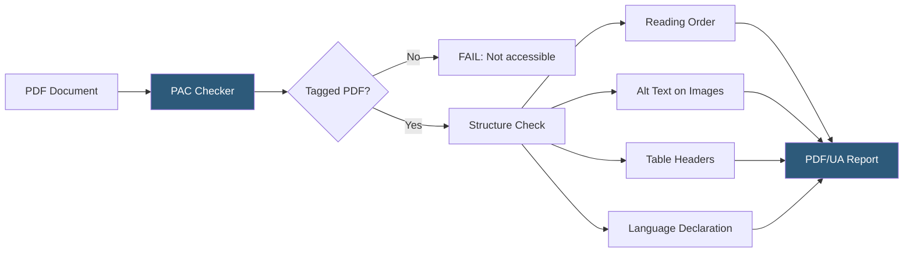

**Category:** Accessibility & Performance Tools
**Difficulty:** Intermediate
**Reading time:** 6 min read

---

Accessible PDF checkers evaluate whether PDF documents are properly tagged and structured to be readable by screen readers and other assistive technologies. PDF accessibility is governed by the PDF/UA (PDF Universal Accessibility) standard and Section 508, making it important for government, legal, financial, and educational documents.

- **Tagged PDF** — a PDF that contains a logical structure tree (tags) defining the reading order and semantic roles of all content; untagged PDFs are typically unreadable by screen readers
- **PDF/UA (ISO 14289)** — the international standard for universally accessible PDFs, defining technical requirements for tags, metadata, and content
- **PAC 3 / PAC 2024** — PDF Accessibility Checker, a free tool from the PDF Association that validates PDFs against PDF/UA
- **Reading Order** — the sequence in which screen readers process PDF content; must match the logical reading order, not the visual layout
- **Artifact** — content marked as non-content in the tag tree (decorative elements, headers/footers, page numbers) that screen readers skip
- **Alt Text for Images** — `<Figure>` tags in PDFs should have `/Alt` entries providing alternative text for image content

PDF accessibility checking has multiple layers. The first, automated layer uses tools like PAC 2024 (free from the PDF Association), Adobe Acrobat Pro's Accessibility Checker, or axesPDF to validate the document against PDF/UA machine-testable rules. These tools verify: the PDF is tagged, all images have alt text, tables have header rows defined, lists are properly tagged as list elements, the document language is declared, and the reading order of tags matches logical order.

Adobe Acrobat Pro includes a built-in accessibility checker (Tools > Accessibility > Full Check) that identifies specific failures with guided remediation. The Tags pane in Acrobat lets you inspect and modify the tag tree — though complex documents often require significant manual work.

Manual testing is essential for complex documents: use Adobe Acrobat's Read Out Loud feature (View > Read Out Loud > Activate) to hear the document as a screen reader would, verifying reading order, table structure, and image descriptions. Testing with NVDA + Adobe Acrobat Reader provides the most realistic screen reader experience.

Common failures in practice: scanned PDFs (no text, no tags — essentially images), PDFs exported from Word/PowerPoint without accessible export settings, complex multi-column layouts with incorrect reading order, data tables without `<TH>` header cells, and decorative images without artifacts.

The remediation workflow for inaccessible PDFs typically involves Adobe Acrobat Pro's automated tagging (which produces a rough tag tree), followed by manual review and correction of reading order, alt text, and table structure.

- Government document publishing — Section 508 requires accessible PDFs for federal agency publications
- Legal document accessibility — court filings, contracts, and policies must be accessible for clients with disabilities
- Financial reporting — annual reports, prospectuses, and SEC filings need PDF/UA compliance
- Academic publishing — research papers and theses increasingly require accessible PDF submission

| Advantage | Disadvantage |
|-----------|--------------|
| PAC 2024 is free and comprehensive | Complex documents require significant manual remediation |
| PDF/UA standard provides clear technical requirements | Automated checks cannot evaluate semantic appropriateness of alt text or reading order |
| Remediation possible without recreating the document | Scanned PDFs require OCR and complete remediation from scratch |
| Accessible PDFs improve search engine indexing | PDFs generated from design tools (InDesign, Word) vary greatly in default accessibility |

- [WCAG 2.1 Compliance Testing](wcag-21-compliance-testing.md)
- [Alt Text Validation](alt-text-validation.md)
- [Video Caption Compliance](video-caption-compliance.md)

---
*Part of the [Accessibility & Performance Tools](index.md) category · [Back to Master Index](../../index.md)*
