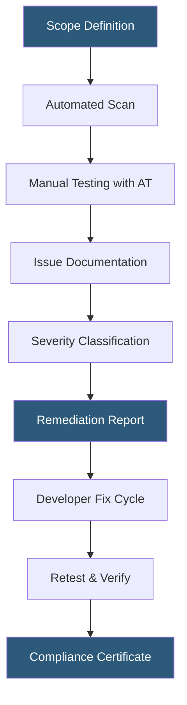

**Category:** Accessibility & Performance Tools
**Difficulty:** Intermediate
**Reading time:** 6 min read

---

ADA (Americans with Disabilities Act) compliance auditing evaluates whether digital properties meet legal accessibility requirements derived from WCAG 2.1 Level AA standards. It matters because non-compliant websites expose organizations to lawsuits, with digital accessibility litigation exceeding 4,000 cases per year in the United States alone.

- **ADA Title III** — the section of the Americans with Disabilities Act that courts have interpreted to cover public-facing websites and mobile apps
- **WCAG 2.1 AA** — the de facto technical standard used to evaluate ADA compliance, covering four principles: Perceivable, Operable, Understandable, Robust
- **Remediation report** — a prioritized list of accessibility barriers found during an audit, with severity ratings and fix recommendations
- **Voluntary Product Accessibility Template (VPAT)** — a structured document listing how a product meets each WCAG criterion, commonly required by enterprise and government buyers
- **Manual audit** — human-led testing using assistive technologies to catch context-dependent issues that automated scanners miss
- **Automated scan** — programmatic analysis catching roughly 30–40% of accessibility issues

ADA compliance auditing combines automated scanning with manual assistive technology testing. Tools like axe-core or Deque's axe DevTools run programmatic checks against WCAG 2.1 success criteria, flagging issues like missing alt text, low color contrast ratios, and form fields without associated labels. Automated tools typically surface 30–40% of all barriers.

The manual phase requires trained auditors using screen readers (JAWS, NVDA, VoiceOver), keyboard-only navigation, and voice control software (Dragon NaturallySpeaking) to identify issues that require human judgment — ambiguous link text, illogical reading order, and complex widgets that lack ARIA live region announcements. Auditors document each issue with a WCAG criterion reference, severity rating (critical/major/minor), and reproduction steps.

Legal risk assessment frames the audit deliverable. Critical issues (those that prevent task completion) are flagged first. The final report maps findings to WCAG 2.1 success criteria and is often used to generate a VPAT. Organizations under active litigation use the audit to demonstrate a good-faith remediation effort. Ongoing compliance requires periodic re-audits — typically after major content or code changes — because new features regularly introduce fresh barriers.

- Pre-launch website audit for a Fortune 500 e-commerce site to preempt legal exposure
- VPAT generation for a SaaS vendor pursuing federal government contracts
- Post-redesign validation ensuring no regressions in accessibility after a CMS migration
- Ongoing monitoring program using automated scans integrated into CI/CD pipelines

| Advantage | Disadvantage |
|-----------|--------------|
| Reduces litigation risk and associated legal costs | Comprehensive manual audits are time-intensive and expensive |
| Expands potential user base to 26% of US adults with disabilities | Compliance does not guarantee a good user experience |
| Automated scanning integrates into DevOps workflows cheaply | Automated tools miss 60–70% of real-world accessibility barriers |

- [WCAG 2.1 Compliance Testing](wcag-21-compliance-testing.md)
- [Section 508 Compliance](section-508-compliance.md)
- [axe DevTools Accessibility](axe-devtools-accessibility.md)

---
*Part of the [Accessibility & Performance Tools](index.md) category · [Back to Master Index](../../index.md)*
