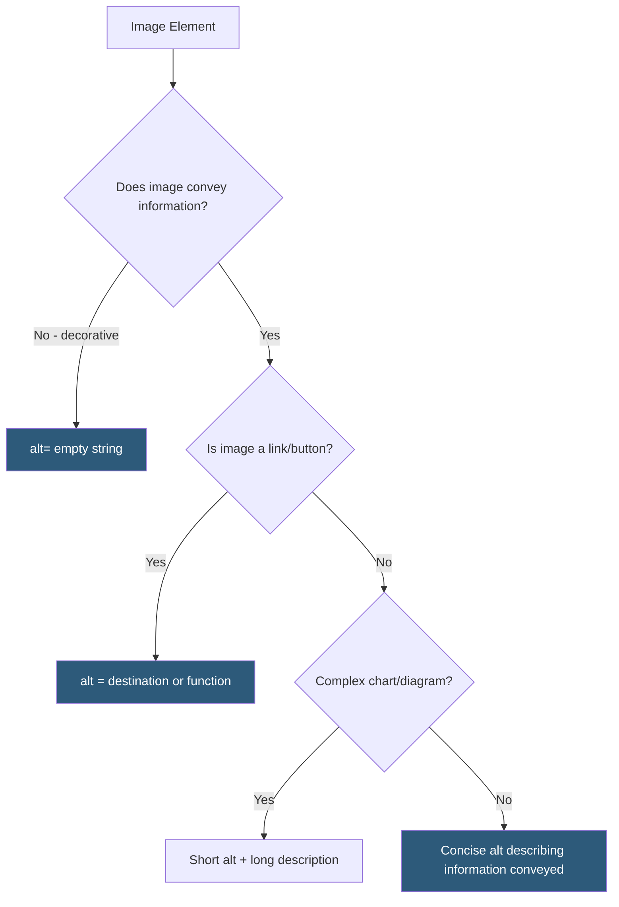

**Category:** Accessibility & Performance Tools
**Difficulty:** Beginner
**Reading time:** 5 min read

---

Alt text validation verifies that images on a web page have appropriate alternative text attributes, ensuring that blind users, users with images disabled, and search engine crawlers receive meaningful descriptions of image content. Missing or inadequate alt text is consistently among the top five WCAG failures found in web accessibility audits.

- **Alt Attribute** — the `alt` attribute on `` elements; if empty (`alt=""`), the image is treated as decorative; if absent, some screen readers announce the filename
- **Decorative Image** — an image that conveys no information beyond visual decoration; should have `alt=""` (empty string, not missing) to tell screen readers to skip it
- **Informative Image** — an image that conveys information; requires alt text describing the information, not the image itself (e.g., alt="Bar chart showing 25% growth in Q3" not alt="chart.png")
- **Functional Image** — an image used as a link or button; alt text should describe the destination or function, not the image content
- **Complex Image** — charts, diagrams, and infographics requiring more than a short description; WCAG allows a long description via `aria-describedby` or adjacent text
- **Background Image** — CSS background images are invisible to accessibility APIs; informational content must not rely solely on CSS backgrounds

Automated tools find images missing the alt attribute entirely — this is a definitive WCAG 1.1.1 failure. However, determining whether existing alt text is appropriate requires human judgment, which is why alt text validation has both automated and manual components.

Tools like axe DevTools, WAVE, and Lighthouse flag: images with no alt attribute (error), images where the alt text appears to be a filename or URL (warning), and images with the same alt text when content suggests they are different (structural warning). These automated checks catch the most egregious failures.

Manual review covers: (1) decorative images — do they have empty alt? (2) informational images — does the alt text describe the information conveyed, not just what the image looks like? (3) logos — does the alt text identify the company/brand? (4) graphs/charts — is there supplementary text explaining the data? (5) icon buttons — does the alt text (or aria-label) describe the button's function?

Common mistakes: `alt="image"`, `alt="photo"`, `alt="logo"` (non-descriptive), `alt="See description below"` (lazy), `alt="chart showing monthly sales figures for Q1-Q4 2023 with peak sales in December reaching $2.4 million"` (overly verbose when the chart is just decoration).

Screen reader testing provides the ground truth: navigate the page with NVDA or JAWS and listen to how images are announced. Images without alt attributes trigger filename or URL announcements; poorly written alt text sounds confusing in context.

- E-commerce product page audits — ensure every product image has descriptive alt text
- Blog and news content review — verify that editorial images added by content editors have appropriate alt
- Automated CI testing — fail builds when images without alt attributes are detected in page renders
- Marketing site optimization — alt text contributes to image SEO as well as accessibility

| Advantage | Disadvantage |
|-----------|--------------|
| Automated tools reliably detect missing alt attributes | Quality of alt text content requires human judgment |
| WCAG 1.1.1 provides clear failure criteria | Large image libraries are time-consuming to audit manually |
| Good alt text improves both accessibility and image SEO | Generative AI tools for auto-alt-text may produce inaccurate descriptions |
| Simple to fix — add or correct a single HTML attribute | Context determines appropriate alt text — the same image needs different alt in different contexts |

- [WAVE Accessibility Checker](wave-accessibility-checker.md)
- [axe DevTools Accessibility](axe-devtools-accessibility.md)
- [WCAG 2.1 Compliance Testing](wcag-21-compliance-testing.md)

---
*Part of the [Accessibility & Performance Tools](index.md) category · [Back to Master Index](../../index.md)*
