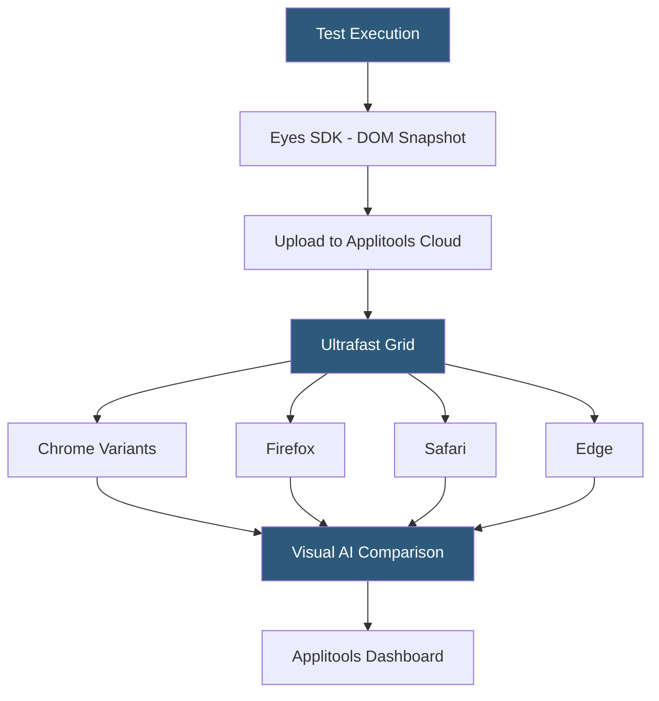

**Category:** Accessibility & Performance Tools
**Difficulty:** Advanced
**Reading time:** 7 min read

---

Applitools Eyes is an AI-powered visual testing platform that uses machine learning to compare UI screenshots and identify meaningful visual differences while automatically ignoring irrelevant rendering noise, scaling visual coverage across thousands of browser-OS-device combinations. It matters because it reduces the false positive rate of visual regression tests to near zero while maintaining high sensitivity to real defects.

- **Visual AI** — Applitools' proprietary deep learning model trained to distinguish meaningful UI changes (broken layouts, missing elements) from benign rendering differences (anti-aliasing, font hinting)
- **Eyes SDK** — language-specific libraries for Java, JavaScript, Python, C#, and others that integrate screenshot capture into existing test frameworks
- **Ultrafast Grid** — Applitools' parallel cloud rendering infrastructure that rerenders DOM snapshots in 60+ browser-OS combinations simultaneously from a single test execution
- **Root cause analysis** — a feature that identifies the specific CSS properties or DOM mutations responsible for a visual diff
- **Contrast advisor** — an accessibility module within Applitools that automatically evaluates color contrast ratios of detected UI text elements

Applitools Eyes captures visual baselines by taking screenshots of application states during test execution using the Eyes SDK. On subsequent runs, screenshots are compared against baselines using Visual AI, which evaluates differences at a semantic level rather than pixel level. The AI model identifies whether a difference represents a content change (text updated, image replaced), layout shift (element moved), or rendering noise (subpixel anti-aliasing), and classifies each accordingly.

The Ultrafast Grid decouples test execution from cross-browser rendering. During a test run, the Eyes SDK captures a single DOM snapshot — a serialized version of the page with all resources inlined. This snapshot is uploaded to Applitools and rendered across all configured browser-OS combinations in parallel. A test suite that previously required running Selenium against 10 browser-OS combinations sequentially can execute once locally and get visual results for all 10 targets simultaneously, reducing test execution time by an order of magnitude.

Root cause analysis is a differentiating capability: when Applitools flags a visual diff, it highlights the specific DOM element and CSS property responsible (e.g., `margin-top` changed from 8px to 16px on a `div.card`), eliminating the need to manually inspect element differences in DevTools. The Contrast Advisor module runs accessibility contrast checks as a byproduct of visual testing, flagging text regions that fall below WCAG AA thresholds.

- Large-scale e-commerce site running visual tests across 50 browser-OS combinations per deploy using Ultrafast Grid with minimal CI time
- Design system team using Applitools to enforce visual consistency across 500+ component stories in Storybook
- Mobile banking app validating payment screens across iOS 15/16/17 and Android 12/13 device combinations
- Accessibility-focused teams combining functional test runs with automatic contrast ratio checks via Contrast Advisor

| Advantage | Disadvantage |
|-----------|--------------|
| AI eliminates the 90%+ false positive rate of pixel-diff tools | Enterprise pricing can be prohibitive for small teams |
| Ultrafast Grid provides massive browser coverage from a single test run | AI model decisions are opaque; occasional misclassifications require manual review |
| Root cause analysis dramatically reduces debugging time | Requires DOM serialization, which can miss canvas/WebGL visual content |

- [Percy Visual Testing](percy-visual-testing.md)
- [BackstopJS Visual Regression](backstopjs-visual-regression.md)
- [Cross-Browser Testing](cross-browser-testing.md)

---
*Part of the [Accessibility & Performance Tools](index.md) category · [Back to Master Index](../../index.md)*
