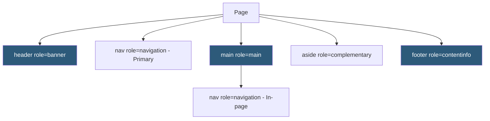

**Category:** Accessibility & Performance Tools
**Difficulty:** Intermediate
**Reading time:** 5 min read

---

ARIA landmark testing verifies that pages have correctly defined HTML landmark regions — header, nav, main, footer, aside, and search — that allow screen reader users to quickly jump to major sections of a page without reading through all content. Landmarks are one of the primary navigation strategies for experienced screen reader users.

- **Landmark Region** — an HTML sectioning element or role that identifies a major section of a page: `<header>` (banner), `<nav>` (navigation), `<main>` (main), `<footer>` (contentinfo), `<aside>` (complementary), `<section>` (region), `<form>` (form)
- **Landmark Navigation** — screen reader keyboard shortcut to jump between landmark regions; D in NVDA, R in JAWS, VO+U in VoiceOver's Rotor
- **Landmark Label** — an `aria-label` or `aria-labelledby` attribute that distinguishes multiple same-type landmarks (e.g., two `<nav>` elements: "Primary navigation" and "Footer navigation")
- **ARIA Role** — explicit `role` attribute values (role="banner", role="navigation", role="main") that create landmarks on non-semantic elements
- **Landmark Coverage** — the percentage of page content contained within landmark regions; all content should be within a landmark
- **Duplicate Landmarks** — multiple landmarks of the same type on a page; acceptable but must be labeled to distinguish them

Screen reader users navigate pages by calling up a list of all landmark regions (D key in NVDA, R key in JAWS) and selecting one to jump directly to it. This allows them to skip straight to the main content, the navigation, or the search area without tabbing through the entire page. Pages without landmarks force screen reader users to read everything sequentially.

The primary landmarks for every web page: one `<header>` at the page level (maps to `role="banner"`), one or more `<nav>` elements for navigation menus, exactly one `<main>` element containing the page's primary content, and one `<footer>` at the page level (maps to `role="contentinfo"`). The `<aside>` element creates a complementary landmark for sidebars and secondary content.

Common failures: (1) using a `
` with a class of "header" instead of an actual `<header>` element, (2) having two `<nav>` elements without labels to distinguish them, (3) nesting a `<footer>` inside `<main>` which makes it lose its contentinfo role, (4) placing content outside any landmark (orphaned content is unreachable via landmark navigation).

Testing approach: use WAVE (it visualizes landmarks with colored icons), Accessibility Insights (shows landmark structure), or the browser's accessibility tree inspector. Screen reader landmark navigation (D key) confirms what users would actually experience.

- Page template auditing — verify all page templates define the correct landmark structure
- Framework migration — confirm component library produces correct landmark semantics
- CMS theme review — validate that CMS-generated page HTML includes proper landmark elements
- Single-page app routing — verify landmarks update when route changes in framework-rendered apps

| Advantage | Disadvantage |
|-----------|--------------|
| Automated tools reliably detect missing or duplicate landmarks | Correct landmark presence doesn't guarantee correct content within each landmark |
| Landmark structure is foundational and doesn't require complex interactions | Multiple same-type landmarks require manual label verification |
| Clear HTML semantics (semantic elements = correct landmarks) | Legacy codebases often use `
` soup requiring role attributes |
| Easy to fix with semantic HTML or role attributes | Framework rendering can obscure landmark structure from source inspection |

- [WAVE Accessibility Checker](wave-accessibility-checker.md)
- [axe DevTools Accessibility](axe-devtools-accessibility.md)
- [Keyboard Navigation Testing](keyboard-navigation-testing.md)

---
*Part of the [Accessibility & Performance Tools](index.md) category · [Back to Master Index](../../index.md)*
