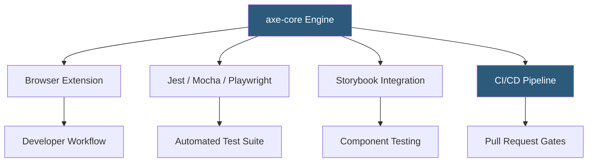

**Category:** Accessibility & Performance Tools
**Difficulty:** Intermediate
**Reading time:** 6 min read

---

axe DevTools is an accessibility testing engine and toolset built by Deque Systems that integrates directly into browser developer tools, CI/CD pipelines, and testing frameworks. It provides automated WCAG conformance checking with a near-zero false-positive rate, making it suitable for engineering teams who need programmatic accessibility testing at scale.

- **axe-core** — the open-source JavaScript library at the heart of all axe products; runs accessibility rules against a DOM snapshot
- **Rule** — a single WCAG or best-practice check implemented in axe-core (currently 90+ rules)
- **Violation** — a confirmed accessibility failure that axe can definitively identify programmatically
- **Incomplete** — an axe result indicating the rule needs human review because the outcome cannot be determined algorithmically
- **Impact Level** — axe categorizes violations as critical, serious, moderate, or minor based on user impact
- **Deque University** — Deque's training platform; axe DevTools Pro subscribers get remediation guidance integrated into violation reports

axe DevTools installs as a browser extension (Chrome, Firefox, Edge) and injects axe-core into the active page. Clicking "Analyze" runs the full rule set against the current DOM, returning violations grouped by impact level. Each violation includes the specific element, a plain-English description of the failure, a link to the WCAG success criterion, and suggested fix guidance.

The real power comes from axe-core's programmatic API. In a Jest test you import axe-core, render your component, and call `axe(document.body)` — violations cause the test to fail exactly like any other assertion. This gates accessibility on every pull request. The same approach works with Playwright, Cypress (via cypress-axe), or Selenium.

axe achieves its low false-positive rate by only flagging issues it can determine algorithmically. Contrast ratios, duplicate IDs, missing form labels, and image alt attributes are evaluated deterministically. Ambiguous cases are returned as "incomplete" requiring manual review. This design means teams trust the automated results and don't ignore them due to noise.

axe DevTools Pro adds guided testing workflows, intelligent guided testing (semi-automated checks for keyboard navigation and screen reader testing), and integrations with issue trackers.

- CI/CD accessibility gates — fail builds when new violations are introduced
- Component library testing — run axe in Storybook to catch issues at the component level before integration
- Developer debugging — browser extension gives immediate feedback during active development
- Regression prevention — axe in automated tests ensures pages that were accessible stay accessible

| Advantage | Disadvantage |
|-----------|--------------|
| Near-zero false positives build team trust | Automated tools only find 30–40% of real-world accessibility issues |
| axe-core is open-source and free for programmatic use | Pro features (guided testing, advanced reporting) require paid license |
| Integrates with virtually every testing framework | Does not test screen reader verbosity or cognitive load |
| Widely used — large community and ecosystem | Rule updates may change pass/fail status between versions |

- [WAVE Accessibility Checker](wave-accessibility-checker.md)
- [Accessibility Insights Testing](accessibility-insights-testing.md)
- [WCAG 2.1 Compliance Testing](wcag-21-compliance-testing.md)

---
*Part of the [Accessibility & Performance Tools](index.md) category · [Back to Master Index](../../index.md)*
