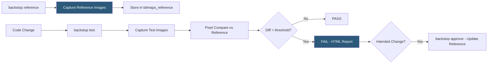

**Category:** Accessibility & Performance Tools
**Difficulty:** Intermediate
**Reading time:** 6 min read

---

BackstopJS is an open-source visual regression testing tool that captures screenshots of configured URL paths using Puppeteer or Playwright and compares them against stored reference images, flagging pixel-level differences in an HTML report. It matters as a free, self-hosted alternative to cloud visual testing services, making visual regression testing accessible to teams with budget constraints or data privacy requirements.

- **Reference screenshot** — the approved baseline image stored in the `bitmaps_reference` folder that future test runs compare against
- **Test screenshot** — the newly captured image placed in `bitmaps_test` during a `backstop test` run
- **Scenario** — a BackstopJS configuration entry defining a URL, viewport size, and optional interaction steps (click, hover, scroll) before capturing
- **misMatchThreshold** — the configurable percentage of pixels allowed to differ before a test is marked as failed (0.1 is typical)
- **Report** — BackstopJS's self-contained HTML diff viewer showing side-by-side, overlay, and difference views for each failed comparison

BackstopJS reads a `backstop.json` configuration file defining an array of scenarios. Each scenario specifies a URL, one or more viewport widths, an optional list of interaction commands (hover over a selector, click a button, wait for an element), and comparison settings. Running `backstop test` launches Puppeteer or Playwright, navigates each scenario, captures screenshots, and saves them to `bitmaps_test`.

The comparison engine uses the `pixelmatch` library to diff test images against reference images pixel by pixel. For each pixel difference, it calculates the percentage of mismatched pixels relative to total pixels. If this value exceeds `misMatchThreshold` (default 0.1%), the test fails. BackstopJS generates an HTML report containing a side-by-side viewer, a red/green difference overlay, and a slider to compare before and after states. The report is a standalone HTML file with no server dependency, making it easy to store as a CI artifact and share.

Running `backstop approve` copies all test screenshots to the reference folder, updating the baseline to the current state. Teams integrate BackstopJS into CI by committing the reference images to the repository and running `backstop test` on every pull request. The HTML report is published as a CI artifact for manual review of any failures. Docker-based execution (`backstop --config backstop.json docker`) ensures consistent Chromium rendering across developer machines and CI environments.

- Open-source project visual regression testing with no budget for cloud testing services
- Agency teams checking that a CSS refactor has not changed the visual appearance of 50 page templates
- Data-sensitive enterprises running visual tests on internal tools without sending page data to third-party clouds
- Teams adding visual regression coverage to an existing Playwright or Puppeteer test suite with minimal additional tooling

| Advantage | Disadvantage |
|-----------|--------------|
| Completely free and open-source with no usage limits | Pixel-diff comparison produces more false positives than AI-based tools |
| Self-hosted — page data never leaves the organization's infrastructure | Reference images committed to git can create large repository sizes |
| Minimal configuration required to get started | No built-in cross-browser coverage; requires separate runs per browser |

- [Percy Visual Testing](percy-visual-testing.md)
- [Applitools Visual AI](applitools-visual-ai.md)
- [Cross-Browser Testing](cross-browser-testing.md)

---
*Part of the [Accessibility & Performance Tools](index.md) category · [Back to Master Index](../../index.md)*
