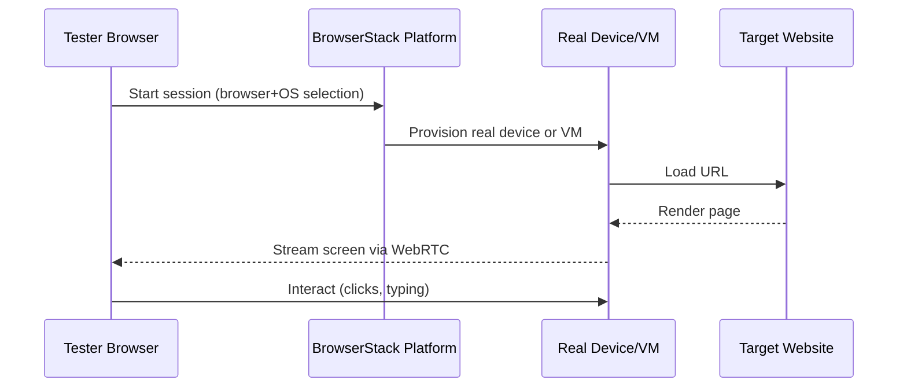

**Category:** Accessibility & Performance Tools
**Difficulty:** Intermediate
**Reading time:** 6 min read

---

BrowserStack Live is a cloud-based platform providing instant access to real browsers on real operating systems and mobile devices, enabling manual interactive testing without maintaining local virtual machines or physical device labs. It matters because real-device testing catches rendering and performance issues that browser emulation misses, particularly on iOS Safari and older Android browsers.

- **Real device cloud** — physical smartphones and tablets hosted in BrowserStack data centers, streamed to testers via browser-based remote sessions
- **Live session** — an interactive remote session where testers can click, type, scroll, and inspect the browser in real time
- **Local testing** — BrowserStack Local Tunnel, a secure proxy that routes BrowserStack's remote browsers through the tester's machine to reach localhost or staging environments not accessible from the internet
- **Screenshot testing** — automated capture of a page's appearance across a configured browser-OS matrix in a single request
- **Responsive testing** — BrowserStack's multi-device preview mode that renders a URL across several viewport sizes simultaneously

BrowserStack maintains a fleet of physical iOS and Android devices and Windows/macOS VMs in its data centers. When a tester selects a browser-OS combination, BrowserStack provisions the matching device or VM and establishes a WebRTC stream to the tester's browser. The connection typically starts within 5–15 seconds. The remote browser is a fully functional instance — cookies persist during the session, developer tools are accessible, and network conditions can be throttled to simulate slow connections.

For testing internal or development environments, BrowserStack Local creates an encrypted SSH tunnel from the test client machine to BrowserStack's infrastructure. This lets remote browsers reach private hosts, localhost addresses, and staging environments behind corporate firewalls. The tunnel is established using a CLI binary (`BrowserStackLocal`) that registers the connection with the BrowserStack API.

BrowserStack Automate extends the platform for automated Selenium, WebDriver, Cypress, and Playwright tests. Test scripts specify a `browserstack.yml` configuration declaring browser-OS combinations, and BrowserStack executes the tests in parallel on its infrastructure, returning logs, video recordings, and screenshots for each combination. Integrations with CI platforms (GitHub Actions, CircleCI, Jenkins) trigger test runs on pull requests.

- Testing a critical checkout flow on iOS 16 Safari when the development team has no Apple devices
- Investigating a CSS rendering bug reported by users on Samsung Internet browser
- Running accessibility tests with JAWS on Internet Explorer 11 for enterprise software clients
- Verifying Local Testing setup to test a staging environment that is not publicly accessible

| Advantage | Disadvantage |
|-----------|--------------|
| Real devices catch hardware-specific bugs emulation misses | Cost scales with parallel sessions and usage hours |
| No device lab management — hardware upgrades handled by BrowserStack | Remote streaming adds ~50–200ms input latency, making performance testing inaccurate |
| Covers 3000+ real device-browser-OS combinations | iOS devices are shared, meaning tests run on the same physical device as other users |

- [Cross-Browser Testing](cross-browser-testing.md)
- [Sauce Labs Testing Cloud](sauce-labs-testing-cloud.md)
- [LambdaTest Cross-Browser](lambdatest-cross-browser.md)

---
*Part of the [Accessibility & Performance Tools](index.md) category · [Back to Master Index](../../index.md)*
