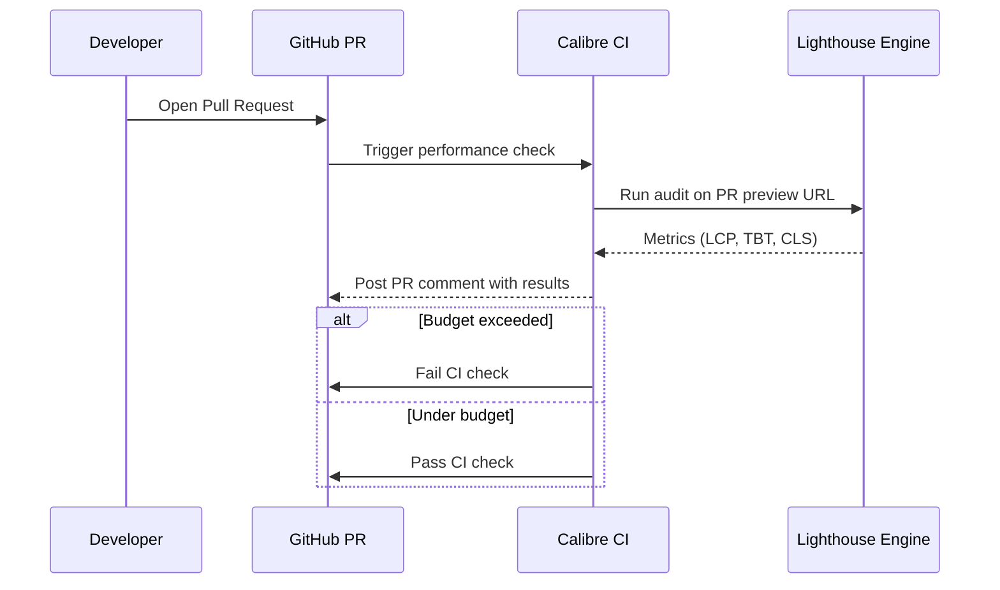

**Category:** Accessibility & Performance Tools
**Difficulty:** Intermediate
**Reading time:** 5 min read

---

Calibre is a continuous performance monitoring platform that runs automated Lighthouse audits on a schedule and tracks metrics over time, with strong emphasis on CI/CD integration and team collaboration. It is designed for engineering teams that want to make performance a shared responsibility by embedding performance testing into every pull request.

- **Performance Profile** — a saved configuration specifying test location, connection speed, and device type used for consistent test comparisons
- **Test** — a single URL + profile combination that Calibre monitors on a schedule
- **Snapshot** — the complete set of metrics collected from one test run; stored indefinitely for historical comparison
- **CI Integration** — Calibre's GitHub/GitLab/Bitbucket integration that runs performance tests on pull requests and reports pass/fail status
- **Team Annotations** — comments attached to specific dates on charts, explaining why a metric changed (deployment, CDN config change, etc.)
- **Budget** — a metric threshold defined per test that causes CI checks to fail when exceeded

Calibre uses Lighthouse under the hood, running tests from servers in multiple geographic regions (Sydney, Tokyo, Frankfurt, Frankfurt, Virginia, California). When you add a URL to Calibre, you select a test profile specifying the location, network speed (4G, 3G, WiFi), and device emulation (desktop or mobile). Tests run on a configurable schedule — every hour is the minimum, daily is common.

Every test run produces a Snapshot with all Lighthouse metrics: Core Web Vitals, performance score, structure metrics, and all Lighthouse diagnostics. Calibre stores these indefinitely, so you can chart LCP performance over 12 months and correlate it with specific events.

The CI integration is Calibre's distinguishing feature. You install the `calibre` CLI in your CI pipeline and configure it to test pull request preview URLs. Calibre runs the full audit and posts a comment on the PR showing current metrics versus the baseline (typically the main branch). If any metric exceeds a defined budget, the CI check fails, blocking the merge. This transforms performance from a post-deployment concern to a pre-merge gate.

The platform has built-in team features: multiple users per organization, email and Slack alerts, and annotation capabilities so teammates can explain metric changes in context.

- Pull request performance gates — prevent performance regressions from merging by failing CI checks
- Cross-team performance visibility — share dashboards with design, product, and engineering teams
- Long-term trend reporting — export charts showing 6-month Core Web Vitals improvement for executive reporting
- Multi-page site monitoring — track 50+ pages across a site with consistent test profiles

| Advantage | Disadvantage |
|-----------|--------------|
| Strong CI/CD integration for pre-merge performance gates | Paid tool with per-test pricing |
| Clean, collaboration-focused team interface | Uses simulated Lighthouse, not real-browser testing like WebPageTest |
| Indefinite history retention | Limited to pages accessible via public URL (no complex authentication flows) |
| Geographic test diversity | Fewer advanced diagnostics than WebPageTest |

- [SpeedCurve Performance Monitoring](speedcurve-performance-monitoring.md)
- [DebugBear Monitoring](debugbear-monitoring.md)
- [Lighthouse Performance Audit](lighthouse-performance-audit.md)

---
*Part of the [Accessibility & Performance Tools](index.md) category · [Back to Master Index](../../index.md)*
