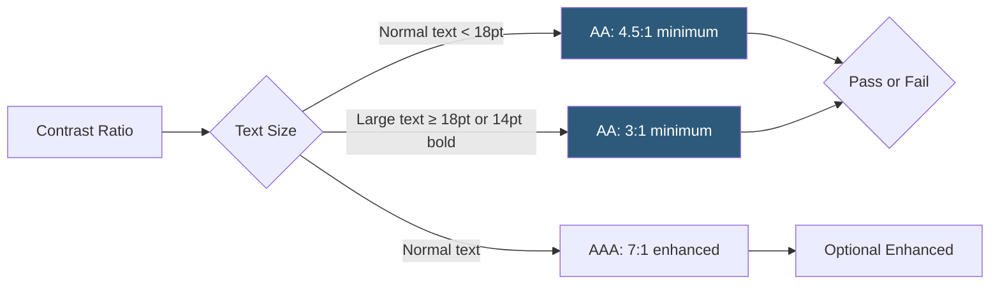

**Category:** Accessibility & Performance Tools
**Difficulty:** Beginner
**Reading time:** 5 min read

---

Color contrast analyzers are tools that measure the luminance ratio between foreground text and background colors to verify compliance with WCAG 2.1 contrast requirements. Insufficient contrast is one of the most common accessibility failures, affecting users with low vision, color blindness, and those using screens in bright outdoor environments.

- **Contrast Ratio** — a value between 1:1 (identical colors) and 21:1 (black on white), calculated from the relative luminance of foreground and background colors
- **WCAG AA Level** — requires a minimum contrast ratio of 4.5:1 for normal text (under 18pt / 14pt bold) and 3:1 for large text and UI components
- **WCAG AAA Level** — enhanced requirement of 7:1 for normal text; recommended for body text but often impractical for all UI elements
- **Relative Luminance** — a mathematical value (0–1) representing a color's perceived brightness calculated from its linear RGB components
- **Color Blindness Simulation** — some analyzers simulate how colors appear to users with deuteranopia, protanopia, or tritanopia
- **Paciello Group Colour Contrast Analyser (CCA)** — the most widely used free desktop color contrast tool

The WCAG contrast ratio is calculated from the relative luminance values of two colors. Relative luminance converts each RGB channel through a gamma correction formula to account for human visual perception, producing a value between 0 (black) and 1 (white). The contrast ratio is then `(L1 + 0.05) / (L2 + 0.05)` where L1 is the lighter color and L2 is the darker.

The Paciello Group's Colour Contrast Analyser (CCA) is a free desktop application (Windows and macOS) with an eyedropper that samples colors from anywhere on your screen — not just web browsers. This makes it useful for testing native application UIs, PDF documents, printed materials, and images. After sampling both foreground and background colors, CCA instantly shows the ratio and whether it passes WCAG AA and AAA thresholds.

Web-based tools like Coolors, Contrast Checker (by WebAIM), and Accessible Colors let you enter hex color values and receive instant pass/fail results. Many design tools (Figma, Sketch, Adobe XD) now include built-in contrast checkers in their accessibility panels.

Browser DevTools also include contrast information: Chrome DevTools' color picker shows contrast ratios when editing CSS colors, and the Accessibility pane shows the computed contrast ratio for the selected element.

An important limitation: the WCAG contrast formula only measures text against solid backgrounds. Complex backgrounds, gradients, images, and translucent overlays require manual judgment.

- Design review — check color palette combinations before development begins
- Rebranding — verify new brand colors meet accessibility standards before implementation
- Template and theme development — ensure all text/background combinations in UI components pass WCAG AA
- PDF accessibility — use the desktop CCA to check contrast in non-browser documents

| Advantage | Disadvantage |
|-----------|--------------|
| Deterministic checks — contrast ratios are mathematically precise | WCAG contrast formula doesn't account for complex backgrounds or text rendering |
| Free tools available for all platforms | Passing contrast doesn't guarantee readability for all users (font weight, size, and typeface also matter) |
| Built into modern design tools reducing workflow friction | WCAG 3.0 proposes a new APCA algorithm that may replace current contrast requirements |
| Screens actual content including non-web documents | Color blindness simulation is approximate, not exact |

- [WCAG 2.1 Compliance Testing](wcag-21-compliance-testing.md)
- [WAVE Accessibility Checker](wave-accessibility-checker.md)
- [axe DevTools Accessibility](axe-devtools-accessibility.md)

---
*Part of the [Accessibility & Performance Tools](index.md) category · [Back to Master Index](../../index.md)*
