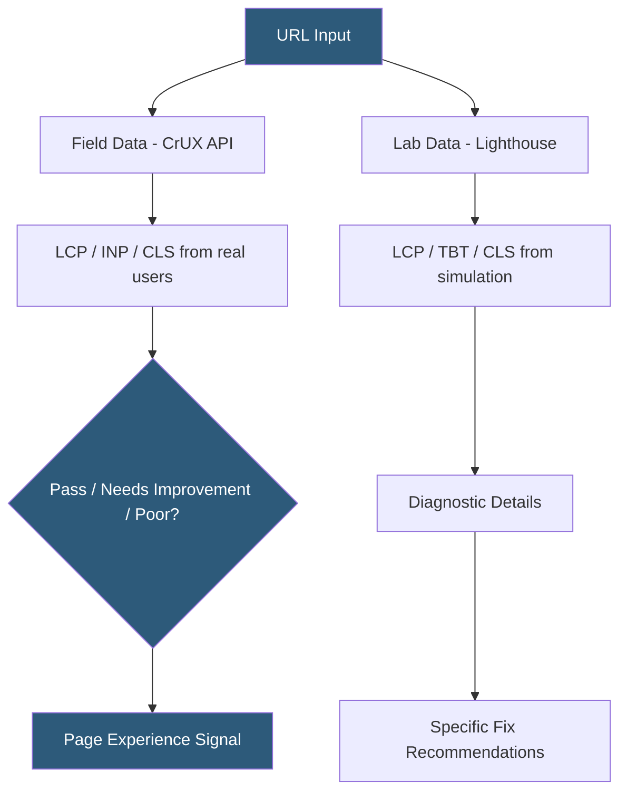

**Category:** Accessibility & Performance Tools
**Difficulty:** Intermediate
**Reading time:** 6 min read

---

Core Web Vitals checkers measure Google's three user-experience-focused page performance metrics — Largest Contentful Paint (LCP), Interaction to Next Paint (INP), and Cumulative Layout Shift (CLS) — using both field data from real users and lab data from controlled measurements. They matter because Core Web Vitals are confirmed Google ranking signals, and improving them directly impacts both search position and user experience quality.

- **Largest Contentful Paint (LCP)** — time from navigation start to when the largest visible image or text block finishes rendering; target ≤2.5 seconds
- **Interaction to Next Paint (INP)** — the worst observed latency from user interaction (click, tap, key press) to the next visual frame; target ≤200ms (replaced First Input Delay in March 2024)
- **Cumulative Layout Shift (CLS)** — sum of all unexpected layout shift scores during page lifetime; target ≤0.1
- **Field data (CrUX)** — real-user measurements aggregated by the Chrome User Experience Report from actual Chrome users over 28 days
- **Lab data** — synthetic measurements from controlled Lighthouse or WebPageTest runs, useful for debugging but not matching real-user conditions

Core Web Vitals data comes from two distinct sources. Field data is collected by Chrome browser instrumentation from real users and aggregated into the Chrome User Experience Report (CrUX) dataset, updated monthly. Google Search Console's Core Web Vitals report and PageSpeed Insights pull from CrUX to show whether a URL's real-user performance meets thresholds. A URL needs sufficient traffic (typically hundreds of sessions per 28-day period) to appear in field data.

Lab data is generated by Lighthouse, which simulates a page load in a controlled Chromium environment on a throttled mobile connection (4G equivalent) and CPU (4x slowdown). Lab measurements are deterministic and reproducible, making them useful for debugging LCP causes (large images, slow server TTFB, render-blocking resources) and CLS causes (images without dimensions, dynamically injected content). However, lab data cannot measure INP because it requires actual user interaction.

The web-vitals JavaScript library (`npm install web-vitals`) enables direct measurement in production code. Embedding `onLCP`, `onINP`, and `onCLS` callbacks allows teams to collect real-user Core Web Vitals and send them to analytics endpoints for custom dashboards. Google Tag Manager also supports Core Web Vitals collection via the built-in Performance template.

- SEO team monitoring Core Web Vitals for 10,000 product pages via Search Console bulk export
- Performance engineer diagnosing a high CLS score caused by a lazy-loaded banner that shifts content on mobile
- Engineering team setting up `web-vitals` library to collect INP data from real users in production analytics
- Pre-launch performance gate in CI using Lighthouse CI to fail builds where LCP exceeds 3 seconds

| Advantage | Disadvantage |
|-----------|--------------|
| Field data reflects actual user experience on real devices and connections | Field data requires sufficient traffic and has a 28-day reporting lag |
| Lab data is reproducible and actionable for debugging specific metrics | Lab data does not correlate perfectly with field data due to device diversity |
| Google-confirmed ranking signal makes improvements directly measurable in search | CLS is difficult to reproduce consistently in lab conditions |

- [Largest Contentful Paint Tracking](largest-contentful-paint-tracking.md)
- [Cumulative Layout Shift Tester](cumulative-layout-shift-tester.md)
- [Google PageSpeed Insights](google-pagespeed-insights.md)

---
*Part of the [Accessibility & Performance Tools](index.md) category · [Back to Master Index](../../index.md)*
