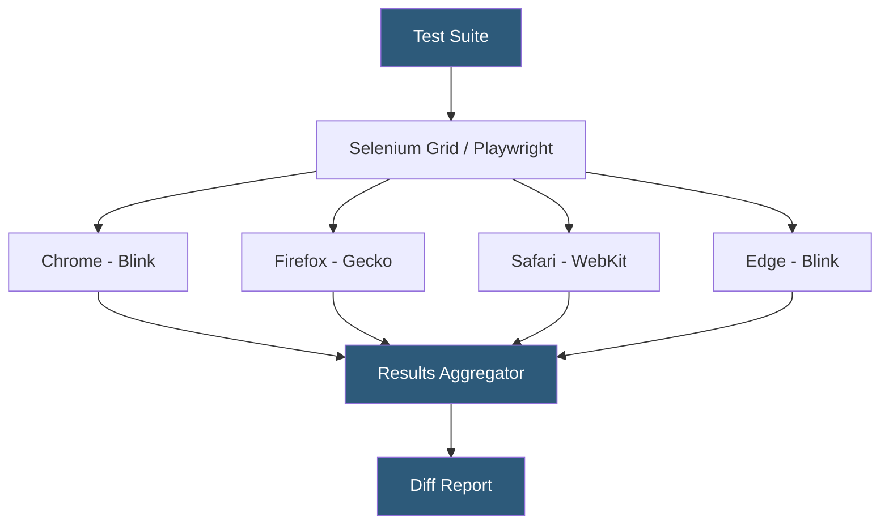

**Category:** Accessibility & Performance Tools
**Difficulty:** Intermediate
**Reading time:** 6 min read

---

Cross-browser testing verifies that a web application behaves consistently across different browser engines (Chromium, Gecko, WebKit) and their versions, catching CSS rendering differences, JavaScript API gaps, and layout inconsistencies that affect real users. It matters because despite standards convergence, browsers still differ in CSS Grid interpretation, form element styling, and experimental feature support.

- **Browser engine** — the rendering and JavaScript execution core: Blink (Chrome, Edge, Opera), Gecko (Firefox), WebKit (Safari, most iOS browsers)
- **Cross-browser bug** — a defect where functionality or appearance differs between browsers, often due to varying CSS spec interpretations or missing API support
- **BrowserStack** — a cloud platform providing real browsers on real operating systems for manual and automated testing without local VM setup
- **Selenium/WebDriver** — the W3C-standardized protocol for programmatic browser control used by most automated cross-browser testing frameworks
- **Visual baseline** — a screenshot taken in the passing state of the application, against which future test runs are compared for visual regressions

Cross-browser testing combines manual exploratory testing and automated scripted checks. For manual testing, cloud platforms like BrowserStack Live and LambdaTest stream a real browser running on a remote VM or device directly into the tester's browser window, enabling interaction without managing local virtual machines. Teams select target browser-OS combinations from a matrix — typically the top 5–10 combinations by their analytics data.

Automated cross-browser testing uses Playwright or Selenium to execute the same test scripts across multiple browser engines. Playwright natively supports Chromium, Firefox (Gecko), and WebKit without plugins, and its cross-browser parity is higher than Selenium because it uses browser-native DevTools protocols rather than WebDriver HTTP. A single Playwright test run with `--browser all` executes against all three engines in parallel, with per-browser screenshots and failure logs.

Visual cross-browser testing adds a screenshot comparison layer. Tools like Percy, Applitools, and BackstopJS capture screenshots in each target browser and diff them pixel-by-pixel, flagging differences above a configurable threshold. Smart diff algorithms use AI to ignore anti-aliasing and font rendering noise while catching actual layout divergence. CSS properties most likely to differ across browsers include flexbox gap support, CSS grid subgrid, `:focus-visible` behavior, custom property inheritance in Shadow DOM, and form element pseudo-element styling.

- CI pipeline running automated Playwright tests across Chrome, Firefox, and Safari on every pull request
- Pre-launch manual testing covering Safari on iOS for CSS flexbox bugs that only appear on WebKit
- Visual regression testing after a CSS framework upgrade to catch layout regressions in Firefox
- Accessibility testing across browsers to verify ARIA attribute behavior differences in screen reader-browser combinations

| Advantage | Disadvantage |
|-----------|--------------|
| Catches engine-specific bugs before they reach users | Maintaining a large browser-OS matrix is time-consuming and costly |
| Cloud platforms eliminate VM management overhead | Safari on iOS cannot be tested outside macOS or real iOS devices due to Apple restrictions |
| Playwright enables fast parallel execution across engines | Browser market share varies by audience; the right matrix depends on analytics data |

- [BrowserStack Live Testing](browserstack-live-testing.md)
- [Sauce Labs Testing Cloud](sauce-labs-testing-cloud.md)
- [Percy Visual Testing](percy-visual-testing.md)

---
*Part of the [Accessibility & Performance Tools](index.md) category · [Back to Master Index](../../index.md)*
