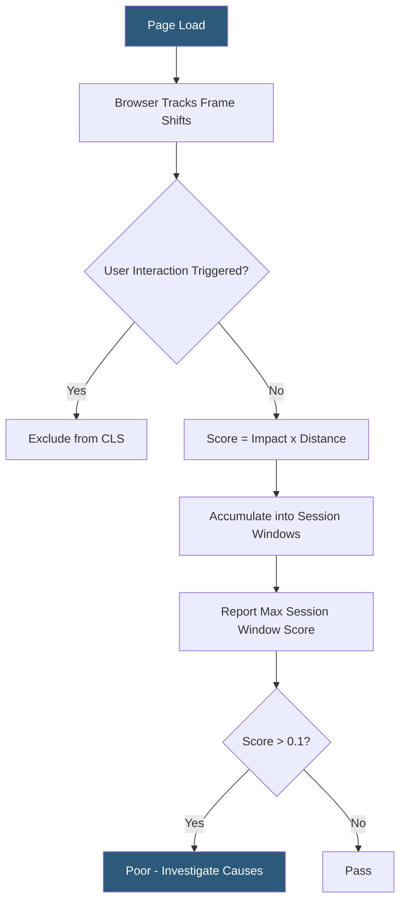

**Category:** Accessibility & Performance Tools
**Difficulty:** Intermediate
**Reading time:** 6 min read

---

Cumulative Layout Shift (CLS) testers measure and diagnose unexpected visual instability during page load by quantifying how much visible page content shifts position, helping developers identify and fix elements that cause disorienting jumps. CLS is one of Google's Core Web Vitals with a target score of ≤0.1, and poor scores directly impact search rankings.

- **Layout shift** — an event where a rendered element changes its position between frames without a user interaction triggering it
- **Layout Shift Score** — the product of the impact fraction (portion of viewport affected) multiplied by the distance fraction (fraction of viewport the element moved), computed per frame
- **Cumulative Layout Shift (CLS)** — the sum of all layout shift scores during the page's lifetime, excluding shifts occurring within 500ms of user input
- **Session window** — a grouping of layout shifts within a 5-second window with no more than 1 second between shifts; the score of the largest window is reported
- **Cause attribution** — identifying which DOM element caused each shift and why (missing image dimensions, dynamically injected content, FOUT)

CLS is measured using the Layout Instability API, available natively in Chrome and Chromium-based browsers. The browser's rendering engine computes a layout shift entry for each frame where elements move unexpectedly, recording the previous and current positions of affected elements, the shift score, and the source elements. The `web-vitals` library exposes these entries via the `onCLS` callback.

Lighthouse and WebPageTest both measure CLS in lab conditions, but because CLS depends on loading sequence and timing, lab measurements can miss shifts that only occur on slow connections or with specific font loading behavior. The most reliable CLS debugging workflow is using Chrome DevTools' Performance panel, which records all layout shift events with timeline markers and shows the `had-recent-input` flag. Clicking a shift event in the Performance panel highlights the shifted element and shows its before/after bounding boxes.

Common CLS causes and fixes: images without explicit `width` and `height` attributes shift content when they load (fix: set dimensions); web fonts cause Flash of Unstyled Text (FOUT) that shifts surrounding text (fix: `font-display: optional` or preload key fonts); dynamically injected banners, cookie notices, and ad slots push content down (fix: reserve space with `min-height`); and late-loading embeds (iframes, widgets) without reserved space collapse content above them.

- Diagnosing a CLS score of 0.35 on a news article page caused by a sticky ad unit loading after the article body
- Setting up `web-vitals` library instrumentation to collect real-user CLS data and segment by page template
- Fixing a 0.2 CLS score on product pages by adding `width` and `height` to all product images
- Measuring CLS improvement after implementing font preloading and `font-display: swap` changes

| Advantage | Disadvantage |
|-----------|--------------|
| Layout Instability API provides exact element-level attribution for debugging | CLS lab measurements are less reliable than field data due to timing variability |
| Session window grouping prevents penalizing intentional multi-step interactions | Third-party scripts causing CLS are outside direct developer control |
| Free measurement using Chrome DevTools Performance panel | CLS can differ significantly between device types and connection speeds |

- [Core Web Vitals Checker](core-web-vitals-checker.md)
- [Largest Contentful Paint Tracking](largest-contentful-paint-tracking.md)
- [Google PageSpeed Insights](google-pagespeed-insights.md)

---
*Part of the [Accessibility & Performance Tools](index.md) category · [Back to Master Index](../../index.md)*
