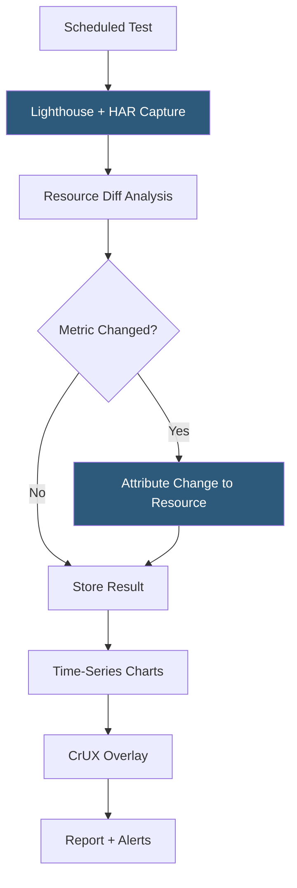

**Category:** Accessibility & Performance Tools
**Difficulty:** Intermediate
**Reading time:** 5 min read

---

DebugBear is a web performance monitoring tool focused on Core Web Vitals tracking with deep diagnostics for identifying the root cause of performance problems. It runs scheduled Lighthouse tests and correlates metric changes with specific resource changes — identifying which JavaScript file, third-party script, or image caused a regression.

- **Request Waterfall** — DebugBear's enhanced waterfall view showing which specific resources triggered which performance metrics
- **Resource Impact Analysis** — DebugBear attributes metric changes (e.g., LCP increased 500ms) to specific resource changes (a new analytics script was added)
- **Chrome UX Report Integration** — DebugBear pulls CrUX field data alongside its lab results, showing both simulated and real-user measurements
- **Real User Monitoring (RUM)** — DebugBear's JavaScript-based RUM agent collects actual user performance data
- **Change Detection** — automatic identification of which resources changed between two test runs, correlating changes with metric shifts
- **Test API** — programmatic API for triggering tests from CI/CD pipelines and retrieving results

DebugBear runs Lighthouse-based tests from its monitoring infrastructure on a defined schedule. Beyond capturing standard Lighthouse metrics, DebugBear records the complete HTTP Archive (HAR) for each test run. When a metric worsens, DebugBear automatically diffs the HAR against the previous run to identify what changed — a new script appeared, an existing image grew in size, or a third-party resource became slower.

This resource-change attribution is DebugBear's key differentiator. When you see LCP increase from 1.8s to 3.2s between two test runs, DebugBear points you to the specific change responsible — for example, "a new Intercom chat widget was added and is blocking the render path." This turns debugging from hours of investigation into minutes.

DebugBear integrates Chrome UX Report data directly into its dashboards, displaying the P75 field values alongside lab results. The side-by-side view makes it easy to see when lab scores diverge from real-user experience, indicating the simulated test environment doesn't represent your user population.

The monitoring alerts are configurable per metric and threshold, with notifications via email or Slack. The CI/CD integration allows testing deployment preview URLs before merging, similar to Calibre and SpeedCurve.

- Third-party script performance auditing — identify exactly which tag manager script is hurting performance
- Regression root cause analysis — find which deployment caused a Core Web Vitals decline
- CrUX vs lab gap investigation — diagnose why real users see worse performance than lab tests suggest
- Performance monitoring for media sites — track pages with heavy image content and detect image optimization regressions

| Advantage | Disadvantage |
|-----------|--------------|
| Resource change attribution speeds up debugging | Paid tool |
| CrUX integration provides field data context | Lab-based, not real-browser testing with physical hardware |
| Change detection catches third-party script insertions | Limited to Lighthouse metrics (no WebPageTest deep-dive) |
| Clean, focused interface | Smaller community and ecosystem than major players |

- [SpeedCurve Performance Monitoring](speedcurve-performance-monitoring.md)
- [Calibre Performance Platform](calibre-performance-platform.md)
- [WebPageTest API](webpagetest-api.md)

---
*Part of the [Accessibility & Performance Tools](index.md) category · [Back to Master Index](../../index.md)*
