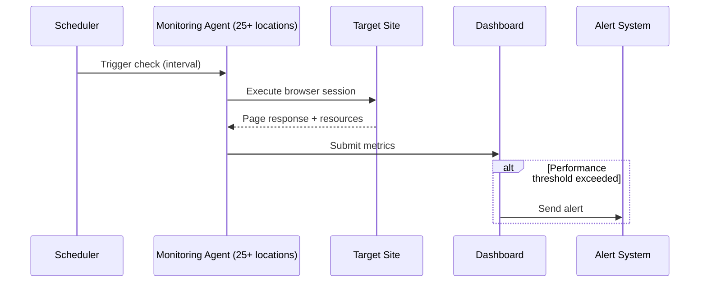

**Category:** Accessibility & Performance Tools
**Difficulty:** Intermediate
**Reading time:** 5 min read

---

Dotcom-Monitor is an enterprise web performance and synthetic monitoring platform that tests websites, web applications, and APIs from over 25 global monitoring locations using real browsers. It specializes in complex multi-step transaction monitoring and supports scripted tests for authenticated user flows, making it suitable for e-commerce and SaaS application monitoring.

- **Synthetic Monitoring** — scripted automated tests that simulate user behavior, running continuously even when no real users are present
- **Transaction Monitoring** — recording and replaying multi-step user workflows (login, add to cart, checkout) to verify end-to-end functionality
- **Browser Agent** — Dotcom-Monitor's monitoring mechanism using real headless browsers (Chrome, Firefox, IE) to render pages exactly as users would
- **Monitoring Location** — one of 25+ geographically distributed probe servers; results from multiple locations give global performance insight
- **Alert Escalation** — configurable notification workflows: first alert to on-call engineer, escalate to manager if not acknowledged within N minutes
- **Waterfall Report** — per-step breakdown of request timing within a monitored transaction, exported as HAR data

Dotcom-Monitor operates a network of probe servers in data centers across North America, Europe, Asia-Pacific, and Latin America. Each probe runs real browser instances that execute your monitoring scripts at the configured interval (as low as 1 minute).

For simple URL monitoring, you provide a URL and expected HTTP status code. For transaction monitoring, you use Dotcom-Monitor's UserView recorder — a Chrome extension that captures your browser actions as a script. The recorder translates clicks, form fills, and navigation into a replayable script. This script can be enhanced with custom JavaScript, conditional logic, and content validation (verify specific text appears after a step).

Each monitoring check produces metrics including full page load time, individual step timing, first byte time, and an error log if any step fails. The waterfall view shows every HTTP request within a step, helping diagnose whether a slowdown is in the HTML, a specific API call, or a third-party resource.

The alerting system supports multi-level escalation: define primary contacts, a delay period, and secondary contacts. Alerts can go via email, SMS, phone call, PagerDuty, Slack, or webhook. Dotcom-Monitor avoids false positives by confirming failures from multiple locations before alerting.

- E-commerce transaction monitoring — verify the full purchase flow from product search through checkout confirmation
- SaaS login testing — monitor login forms, dashboard loads, and critical workflow steps
- API endpoint monitoring — test REST API responses including JSON content validation
- Global CDN performance tracking — compare load times from Asia, Europe, and North America

| Advantage | Disadvantage |
|-----------|--------------|
| Real browser rendering captures JavaScript-heavy applications | Higher cost than simple ping-based monitoring tools |
| Multi-step transaction monitoring covers complex workflows | Script maintenance required when UI changes break recordings |
| 25+ global probe locations | More complex to configure than basic uptime tools |
| Granular waterfall data for diagnosing transaction slowness | Enterprise pricing may be excessive for small sites |

- [Pingdom Website Speed Test](pingdom-website-speed-test.md)
- [SpeedCurve Performance Monitoring](speedcurve-performance-monitoring.md)
- [New Relic Browser Monitoring](new-relic-browser-monitoring.md)

---
*Part of the [Accessibility & Performance Tools](index.md) category · [Back to Master Index](../../index.md)*
