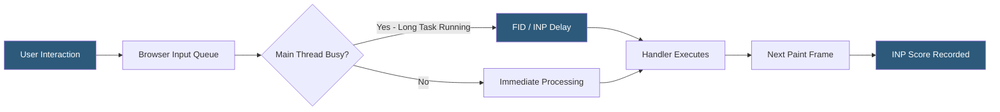

**Category:** Accessibility & Performance Tools
**Difficulty:** Intermediate
**Reading time:** 5 min read

---

First Input Delay (FID) was the original Core Web Vital measuring the delay between a user's first interaction with a page and when the browser could actually respond, quantifying JavaScript main-thread blocking during page load. It matters historically as the precursor to Interaction to Next Paint (INP), which replaced it in March 2024 as a more comprehensive interactivity metric.

- **First Input Delay (FID)** — the time from when a user first interacts with a page (click, tap, key press) to when the browser begins processing event handlers; target was ≤100ms
- **Main thread blocking** — the state where the browser's JavaScript main thread is occupied parsing and executing scripts, preventing it from responding to user input
- **Long Task** — any JavaScript execution that takes longer than 50ms on the main thread, measured via the Long Tasks API
- **Total Blocking Time (TBT)** — a Lighthouse lab metric that correlates with FID by summing the portions of long tasks exceeding 50ms; used as a proxy for FID in lab conditions
- **Interaction to Next Paint (INP)** — FID's successor that measures the worst interaction latency across the entire page session, not just the first interaction

FID is measured only from field data because it requires a real user to interact with the page. The browser records the timestamp of the first user input event and the timestamp when the event handler begins processing; the difference is FID. Because FID measures only the first interaction and only the input delay (not the processing or rendering time), it was a limited metric — a page could have a good FID if users happened to interact after the main thread cleared, while still having poor responsiveness to subsequent interactions.

INP addresses these limitations by recording every interaction throughout the page's lifetime and reporting the worst case (at the 98th percentile for pages with many interactions). INP includes input delay, event processing time, and presentation delay — the full response latency chain. Measurement tools that surface INP include Chrome DevTools Performance Insights panel, the `web-vitals` library's `onINP` callback, and Google Search Console's Core Web Vitals report (which switched from FID to INP in March 2024).

Legacy systems and dashboards that collected FID data should migrate to INP collection. The `web-vitals` library (v3.x+) defaults to INP. Historical FID data remains useful for identifying pages with high main-thread contention; the underlying cause — large JavaScript bundles, synchronous third-party scripts, and inefficient event handlers — is the same for both metrics.

- Auditing legacy field data dashboards to understand historical interactivity baseline before migrating to INP
- Diagnosing main-thread blocking using the Long Tasks API to find scripts causing poor first-interaction responsiveness
- Migrating `web-vitals` library instrumentation from FID collection to INP collection after the March 2024 Core Web Vitals update
- Correlating high TBT scores in Lighthouse lab data with poor field-measured INP scores

| Advantage | Disadvantage |
|-----------|--------------|
| FID historical data remains useful for identifying main-thread blocking patterns | FID is no longer a Google ranking signal; INP replaced it |
| Long Tasks API provides granular insight into main-thread execution | FID only captures first interaction, missing ongoing responsiveness issues |
| TBT is a reliable lab proxy when field data volume is insufficient | INP is harder to measure in lab conditions since it requires actual interactions |

- [Core Web Vitals Checker](core-web-vitals-checker.md)
- [Largest Contentful Paint Tracking](largest-contentful-paint-tracking.md)
- [Lighthouse Performance Audit](lighthouse-performance-audit.md)

---
*Part of the [Accessibility & Performance Tools](index.md) category · [Back to Master Index](../../index.md)*
