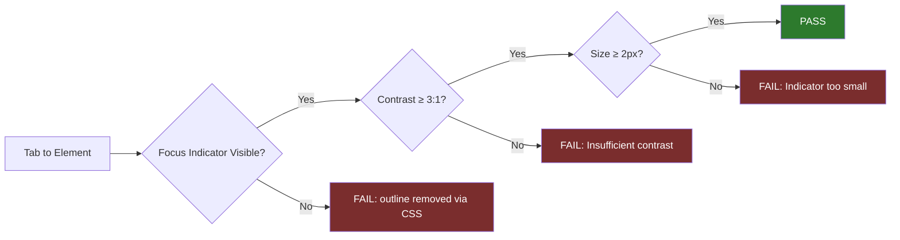

**Category:** Accessibility & Performance Tools
**Difficulty:** Beginner
**Reading time:** 5 min read

---

Focus indicator testing verifies that the visual focus highlight — the outline or glow that appears on an element when it receives keyboard focus — is present, visible, and has sufficient contrast. WCAG 2.1 Success Criterion 2.4.7 requires that keyboard focus be visible, while WCAG 2.4.11 (Level AA in WCAG 2.2) adds specific minimum size and contrast requirements.

- **Focus Indicator** — the visual style applied to an element when it is keyboard-focused, typically a border or outline in a contrasting color
- **WCAG 2.4.7 Focus Visible (AA)** — requires that keyboard focus is visible; this is intentionally simple and allows flexible implementation
- **WCAG 2.4.11 Focus Appearance (AA, added in 2.2)** — specifies minimum focus indicator size (at least 2 CSS pixels) and a minimum 3:1 contrast ratio against adjacent colors
- **`:focus-visible`** — a CSS pseudo-class that applies focus styles only when the browser determines keyboard navigation is being used, avoiding outlines on mouse clicks
- **Browser Default Focus Ring** — each browser has a default focus outline style; CSS `outline: 0` or `outline: none` removes it, causing focus invisibility
- **Custom Focus Styles** — design-aligned focus indicators (brand color outlines, box shadows, underlines) that replace browser defaults while maintaining visibility

Focus indicator testing is primarily a keyboard + visual inspection task. The tester removes their hand from the mouse and presses Tab repeatedly, watching for the focus indicator to move between elements. For each focused element, they verify: (1) a visible focus indicator exists, (2) it has sufficient contrast against its surroundings (at least 3:1 under WCAG 2.2 AA), and (3) it meets minimum size requirements.

The most common failure is CSS that removes browser default outlines without providing an alternative: `button { outline: none; }` or `a:focus { outline: 0; }`. This pattern was historically used to avoid the "ugly" browser default ring, but creates a complete focus visibility failure.

The `:focus-visible` CSS pseudo-class solves the design vs. accessibility tension: `button:focus-visible { outline: 3px solid #005fcc; }` applies a clear focus indicator for keyboard users but not when a mouse is used to click the button. Modern browsers support `:focus-visible`, though `:focus` should be used as a fallback.

Testing tools: the Accessibility Insights "Tab Stops" feature draws numbered circles on focused elements as you tab, making the focus order and indicator visibility visually obvious. Browser DevTools can inspect computed styles on `:focus` state by using the "Toggle element state" feature.

Color contrast of focus indicators follows the same measurement approach as text contrast: use a contrast analyzer (CCA or similar) to measure the ratio between the indicator color and adjacent colors.

- CSS audit — find all instances of `outline: none` that remove focus styles
- Design system review — verify component library provides accessible default focus styles
- High-contrast mode testing — verify custom focus indicators remain visible in Windows High Contrast mode
- Dark mode testing — verify focus indicators are visible in both light and dark themes

| Advantage | Disadvantage |
|-----------|--------------|
| Simple to test visually — just press Tab and observe | Pixel-level contrast measurement requires a tool |
| WCAG 2.4.7 and 2.4.11 provide clear pass/fail criteria | Browser default outlines vary — rely on explicit CSS specifications |
| `:focus-visible` enables design-friendly focus styles | WCAG 2.4.11 requires measuring both indicator area and contrast against multiple adjacent colors |
| Automated tools like axe catch common `outline: 0` patterns | Some custom focus patterns (text underline, background change) are harder to evaluate mechanically |

- [Keyboard Navigation Testing](keyboard-navigation-testing.md)
- [Color Contrast Analyzers](color-contrast-analyzers.md)
- [WCAG 2.1 Compliance Testing](wcag-21-compliance-testing.md)

---
*Part of the [Accessibility & Performance Tools](index.md) category · [Back to Master Index](../../index.md)*
