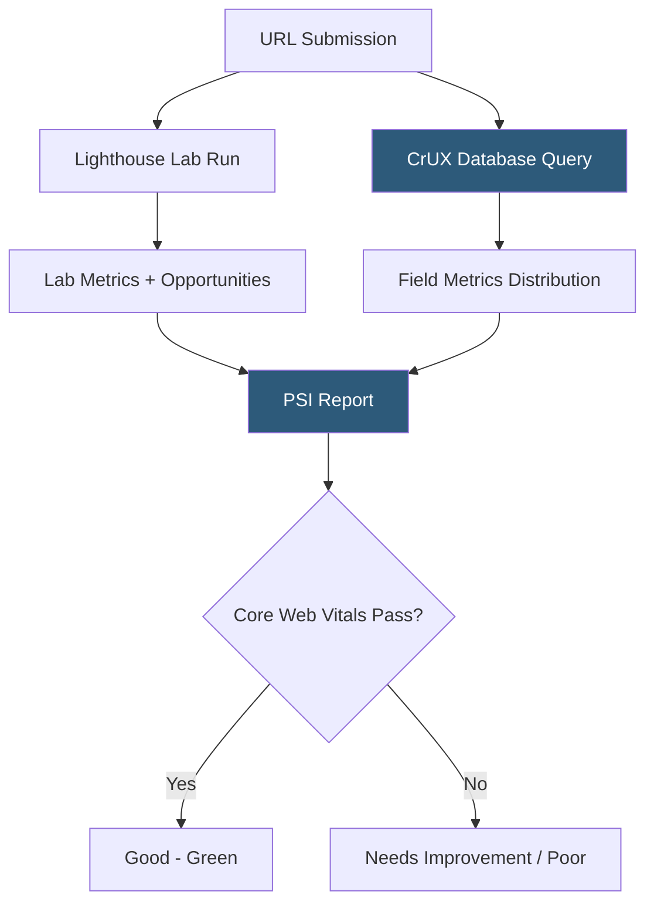

**Category:** Accessibility & Performance Tools
**Difficulty:** Beginner
**Reading time:** 5 min read

---

Google PageSpeed Insights (PSI) combines real-user performance data from the Chrome User Experience Report (CrUX) with Lighthouse lab data to give developers both field measurements and diagnostic recommendations in one free tool. The real-world data component makes PSI uniquely valuable for understanding how actual users experience a site across diverse devices and network conditions.

- **CrUX (Chrome User Experience Report)** — a public dataset of real performance measurements collected from Chrome users who have opted in to usage statistics
- **Field Data** — performance metrics collected from real users visiting the site; reflects true diversity of devices and connections
- **Lab Data** — Lighthouse measurements taken in a controlled simulated environment; useful for debugging but may differ from field data
- **Core Web Vitals** — the three metrics Google uses for search ranking signals: LCP, INP (Interaction to Next Paint), and CLS
- **INP (Interaction to Next Paint)** — replaced FID in 2024; measures responsiveness by timing the delay between any user interaction and the next frame painted
- **Origin Summary** — PSI can aggregate field data across all pages of a domain, not just a single URL

When you enter a URL into PageSpeed Insights, two parallel processes run. First, a Lighthouse audit runs in Google's servers against the URL, producing lab-based performance scores and diagnostic recommendations identical to what you'd see in Chrome DevTools. Second, PSI queries the CrUX dataset for the past 28 days of real-user measurements for that URL (or the origin if the specific page lacks sufficient traffic).

Field data shows the distribution of LCP, INP, and CLS scores from real users, broken into three thresholds: good (green), needs improvement (yellow), and poor (red). The 75th percentile value determines pass/fail — if 75% of users experience LCP under 2.5 seconds, the page passes. This percentile-based approach ensures good performance for the majority of users, not just average users.

PSI exposes a free API (`https://www.googleapis.com/pagespeedonline/v5/runPagespeed`) that accepts a URL and returns the full JSON report. Teams use this API in monitoring scripts to track score trends over time, alert when scores drop, or compare competitors.

The key differentiator from Lighthouse alone is the field data: a page might score 90 in Lighthouse's simulated environment but show poor LCP in the field because many users are on slow connections or older phones. This discrepancy is diagnostic — it tells you the lab simulation doesn't capture your actual user population.

- SEO performance check — Google uses Core Web Vitals as a ranking signal; PSI shows your signal values
- Before/after measurement — test a specific page before and after optimization to verify improvement
- Automated monitoring — poll the PSI API daily to track performance regression over time
- Competitor benchmarking — compare field data availability across competing sites

| Advantage | Disadvantage |
|-----------|--------------|
| Free with no account required | Field data requires minimum traffic threshold (not available for low-traffic pages) |
| Real-user field data reflects actual experience | API has rate limits that restrict large-scale monitoring |
| Combines lab diagnostics with field evidence | Field data has a 28-day lag; recent changes don't appear immediately |
| Official Google tool aligned with search ranking signals | Lab results can vary between runs |

- [Lighthouse Performance Audit](lighthouse-performance-audit.md)
- [Core Web Vitals Checker](core-web-vitals-checker.md)
- [WebPageTest Performance Testing](webpagetest-performance-testing.md)

---
*Part of the [Accessibility & Performance Tools](index.md) category · [Back to Master Index](../../index.md)*
