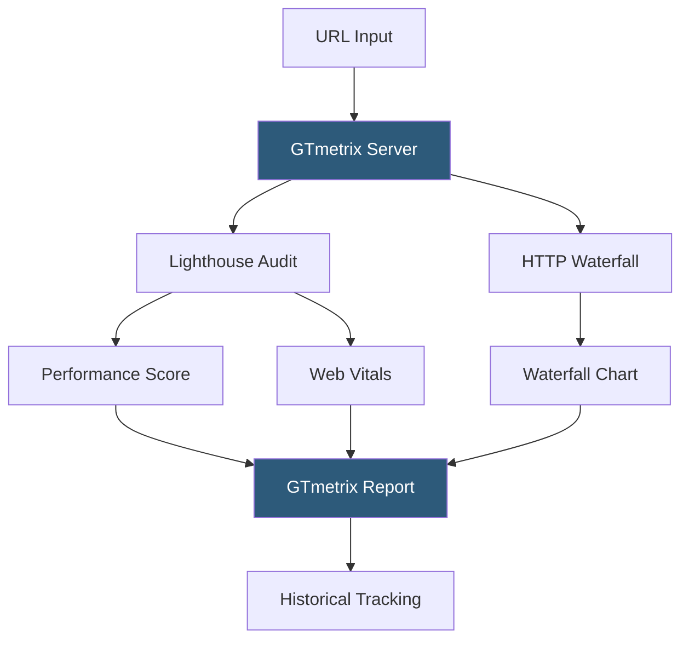

**Category:** Accessibility & Performance Tools
**Difficulty:** Beginner
**Reading time:** 5 min read

---

GTmetrix is a web performance testing service that combines Google Lighthouse scores with waterfall analysis to give developers a comprehensible performance report. It is particularly popular for its accessible interface, historical score tracking, and scheduled monitoring alerts that notify teams when page performance degrades.

- **GTmetrix Grade** — a letter grade (A through F) derived from the Lighthouse Performance score and Web Vitals, providing a quick performance summary
- **Web Vitals** — the subset of metrics Google uses for search ranking (LCP, INP, CLS) displayed prominently in GTmetrix reports
- **Performance Score** — the Lighthouse-based 0–100 score weighted from Core Web Vitals and additional timing metrics
- **Structure Score** — GTmetrix's additional score measuring implementation of best practices like compression, caching headers, and image optimization
- **Scheduled Monitoring** — recurring automated tests that run at defined intervals (hourly to weekly) and send alerts when scores drop
- **Location Testing** — test from servers in multiple geographic regions to measure CDN effectiveness and regional latency

GTmetrix runs Lighthouse in a controlled browser environment on its own servers, capturing performance metrics, Core Web Vitals, and an HTTP waterfall simultaneously. The free tier tests from Vancouver, Canada using a desktop Chrome browser; paid tiers unlock testing from 22 global locations and mobile device simulation.

After running the test, GTmetrix stores the result in your account history, allowing you to compare current scores against previous runs with a visual chart. The "Analysis Options" let you set custom connection speed profiles (throttle to 3G, 4G, or Cable), add custom cookies for authenticated testing, or block specific third-party domains to measure their performance impact in isolation.

The Recommendations tab lists specific issues sorted by severity and estimated savings. Each recommendation includes code-level examples and links to explanations — a less technical audience can understand the findings without deep performance engineering knowledge.

GTmetrix Pro adds scheduled monitoring: you define a URL, test frequency, location, and alert thresholds. If the Performance score drops below 70 or LCP exceeds 4 seconds, GTmetrix emails your team immediately. This passive monitoring is valuable for catching third-party script regressions, CDN outages, or deployment-caused slowdowns that manual testing would miss.

- Monitoring score trends over time — track whether optimization work is maintaining gains
- Client reporting — share branded, readable reports with stakeholders who need to approve performance budgets
- Third-party impact isolation — block analytics or ad scripts to quantify their performance cost
- Regional performance testing — verify CDN cache behavior from multiple geographic locations

| Advantage | Disadvantage |
|-----------|--------------|
| Beginner-friendly interface with clear letter grades | Free tier limited to one test location and basic features |
| Historical tracking shows score trends over time | Scheduled monitoring requires paid subscription |
| Shares Lighthouse engine so scores align with Google tools | Results may differ from field data due to simulated conditions |
| Easy client-facing reports | Less diagnostic depth than WebPageTest for advanced analysis |

- [Lighthouse Performance Audit](lighthouse-performance-audit.md)
- [WebPageTest Performance Testing](webpagetest-performance-testing.md)
- [Pingdom Website Speed Test](pingdom-website-speed-test.md)

---
*Part of the [Accessibility & Performance Tools](index.md) category · [Back to Master Index](../../index.md)*
