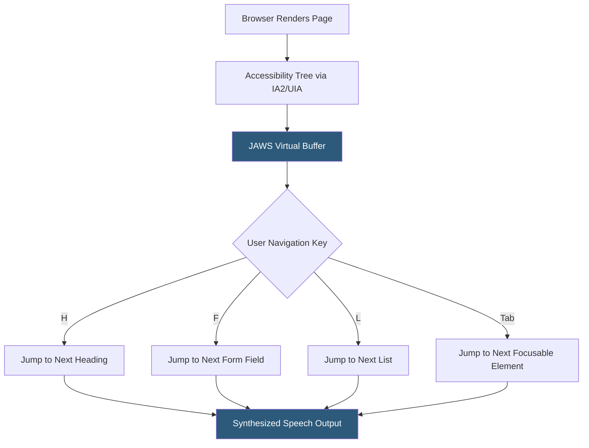

**Category:** Accessibility & Performance Tools
**Difficulty:** Intermediate
**Reading time:** 6 min read

---

JAWS (Job Access With Speech) is the most widely used commercial screen reader among professional and workplace users, particularly in enterprise and government environments. Developed by Freedom Scientific, JAWS sets the standard for how accessibility features must behave in web applications that serve enterprise users and regulated industries.

- **Virtual PC Cursor** — JAWS's browse mode for web content; a virtual cursor navigates through the accessibility tree independently of physical keyboard focus
- **Forms Mode** — JAWS automatically switches into forms mode when entering input fields, allowing keystrokes to be typed rather than intercepted as navigation commands
- **JAWS Web Application** — designation for complex web apps using ARIA that require JAWS to bypass its virtual cursor; configured via `role="application"`
- **Application Verbosity** — JAWS settings controlling how much detail is announced (element type, state, value); users customize this based on preference and expertise
- **ScratchPad** — JAWS's virtual clipboard where users paste text from screen content for review or comparison
- **JAWS Scripting** — a proprietary scripting language allowing advanced users to customize JAWS behavior for specific applications

JAWS accesses the browser's accessibility tree through Windows accessibility APIs (IAccessible2 for Firefox, UI Automation for Chrome/Edge). It builds an internal virtual buffer representing the entire page as a linear stream of accessible elements. This buffer is independent of visual layout — absolute positioned elements appear in DOM order, not visual order.

When a user presses the H key in browse mode, JAWS jumps to the next heading element in the virtual buffer and reads its text and heading level aloud. Tab moves through focusable elements. Arrow keys move character by character or line by line through text. JAWS announces element types, states (checked, expanded, required), and values automatically.

JAWS differs from NVDA in several key areas: JAWS has better compatibility with legacy enterprise applications, a more sophisticated scripting system for customization, and historically broader adoption in corporate and government procurement. JAWS is the dominant screen reader in North America's enterprise market.

For testing purposes, the critical JAWS + browser combination is JAWS + Chrome, as Chrome + UIA is the most-used production combination. JAWS + Firefox remains relevant for its superior ARIA support.

Testing focus areas unique to JAWS include: virtual buffer caching behavior (JAWS may cache stale content after dynamic updates), custom JAWS-specific announcement messages via `aria-describedby`, and behavior in iframes (JAWS handles nested documents differently from NVDA).

- Enterprise application accessibility testing — JAWS is required by many corporate and government procurement standards
- Legal compliance verification — ADA, Section 508, and EN 301 549 compliance testing requires JAWS testing for regulated sectors
- Customer service portal testing — call centers using screen reader-dependent tools require JAWS compatibility
- Financial and insurance application testing — these sectors have high JAWS usage among employees with visual impairments

| Advantage | Disadvantage |
|-----------|--------------|
| Most common screen reader in enterprise, government, and legal contexts | Commercial product; requires paid license (approximately $1,000/year) |
| Most thoroughly tested by screen reader users in high-stakes environments | Windows only |
| Superior legacy application support | Behavior can differ from NVDA, requiring separate testing |
| Industry standard for accessibility compliance claims | Complex scripting system has a steep learning curve |

- [NVDA Screen Reader Testing](nvda-screen-reader-testing.md)
- [VoiceOver Accessibility Testing](voiceover-accessibility-testing.md)
- [Accessibility Insights Testing](accessibility-insights-testing.md)

---
*Part of the [Accessibility & Performance Tools](index.md) category · [Back to Master Index](../../index.md)*
