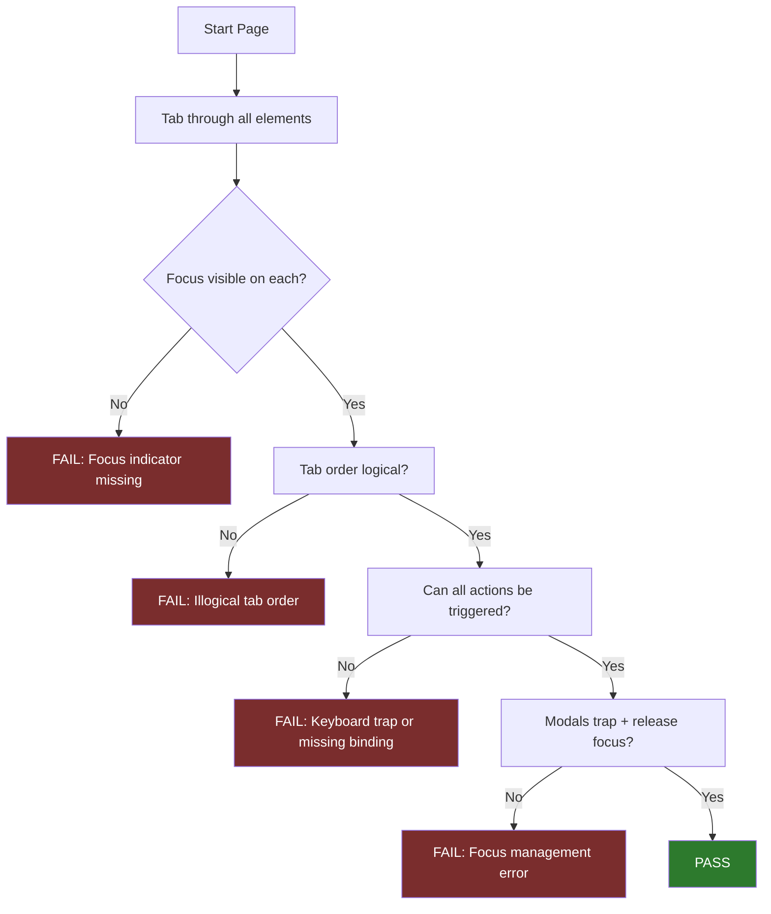

**Category:** Accessibility & Performance Tools
**Difficulty:** Beginner
**Reading time:** 5 min read

---

Keyboard navigation testing verifies that every function available via mouse is also accessible using only a keyboard. This is a WCAG 2.1 Level A requirement (Success Criterion 2.1.1) and benefits keyboard-only users, power users, users with motor disabilities, and screen reader users who navigate via keyboard.

- **Focus** — the currently active element on a page; keyboard users activate the focused element with Enter or Space
- **Tab Order** — the sequence in which focus moves through interactive elements when Tab is pressed; should follow the logical reading order
- **Focus Trap** — a bug where keyboard focus enters a region (modal, widget) and cannot exit without mouse interaction; blocks keyboard navigation
- **Skip Navigation Link** — a "Skip to main content" link at the top of the page, visible only on focus, allowing keyboard users to bypass repetitive navigation menus
- **Focus Indicator** — the visible outline or highlight showing which element is currently focused; WCAG 2.1 AA requires focus be visible
- **Focus Management** — programmatically moving focus (via `element.focus()`) to the right element after dynamic events like opening a modal or completing a multi-step form

Keyboard navigation testing requires no special tools beyond a keyboard and browser. The tester puts the mouse aside entirely and navigates exclusively with keyboard:

- **Tab** moves focus forward through interactive elements
- **Shift+Tab** moves focus backward
- **Enter** activates links and buttons
- **Space** activates checkboxes and buttons
- **Arrow keys** navigate within widgets (radio groups, select dropdowns, carousels)
- **Escape** dismisses modals, dropdowns, and tooltips

A complete keyboard test covers: (1) every interactive element is reachable by Tab, (2) focus indicator is always visible (a 2px outline minimum per WCAG 2.4.11), (3) tab order matches the visual/logical reading order, (4) no focus traps exist (Tab always moves focus out of any region), (5) all modal dialogs move focus inside on open and return focus to the trigger on close, (6) custom JavaScript widgets (dropdowns, date pickers, sliders) respond to arrow keys as expected, and (7) a skip navigation link exists at the page top.

Testing tools that assist keyboard testing include Accessibility Insights' Tab Stops visualization (draws numbered circles on focused elements showing the order), and taba11y (a Chrome extension that numbers tab stops visually as you press Tab).

- Component library testing — test every interactive component in isolation for keyboard operability
- Form testing — verify complex multi-step forms including conditional logic are keyboard operable
- Modal and overlay testing — confirm focus traps, focus restoration, and Escape key behavior
- Single-page application testing — verify focus is managed correctly after route changes and dynamic updates

| Advantage | Disadvantage |
|-----------|--------------|
| No special tools required | Manual testing is time-consuming for large applications |
| Tests the actual user experience for keyboard and screen reader users | Easy to overlook edge cases in complex dynamic UIs |
| Covers issues automated tools cannot detect (focus management logic) | Requires trained testers who understand expected keyboard behavior |
| Verifiable against clear WCAG success criteria | JavaScript frameworks can interfere with default keyboard behavior |

- [Accessibility Insights Testing](accessibility-insights-testing.md)
- [Focus Indicator Testing](focus-indicator-testing.md)
- [axe DevTools Accessibility](axe-devtools-accessibility.md)

---
*Part of the [Accessibility & Performance Tools](index.md) category · [Back to Master Index](../../index.md)*
