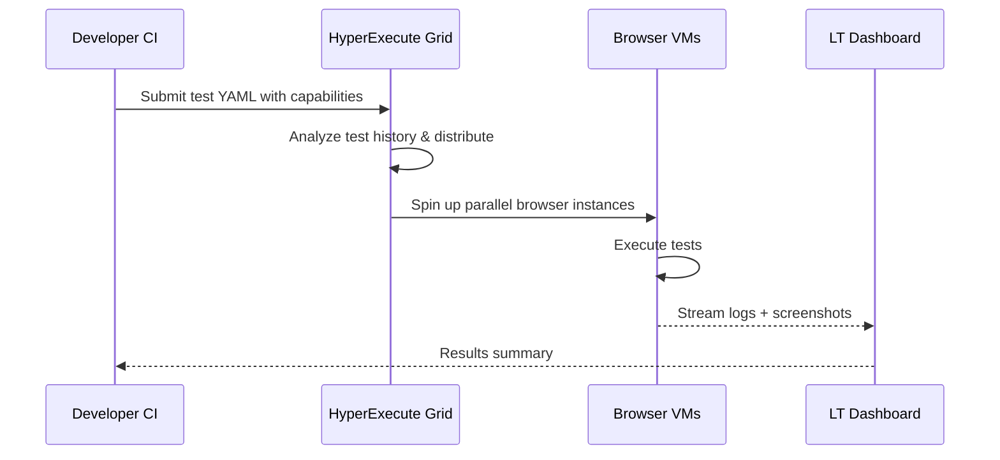

**Category:** Accessibility & Performance Tools
**Difficulty:** Intermediate
**Reading time:** 5 min read

---

LambdaTest is a cloud-based cross-browser testing platform offering real browser testing on 3000+ browser-OS combinations, with HyperExecute for fast parallel test execution and AI-powered test analytics. It matters as a cost-competitive alternative to BrowserStack and Sauce Labs with particular strengths in automated test speed through its Kubernetes-based HyperExecute grid.

- **HyperExecute** — LambdaTest's Kubernetes-native smart test orchestration grid that reduces test suite duration by intelligently distributing tests based on past execution data
- **LT Browser** — a desktop application that previews websites across multiple viewport sizes simultaneously without a remote session
- **LambdaTest Tunnel** — the secure proxy for testing localhost and private environments from LambdaTest's remote browsers
- **Smart UI** — LambdaTest's AI-based visual regression testing that compares screenshots across browsers and ignores rendering noise
- **Cypress Cloud** — LambdaTest's native Cypress execution environment with parallelization support

LambdaTest's standard automation uses a Selenium-compatible hub at `hub.lambdatest.com`. Tests pass desired capabilities specifying browser name, version, OS platform, and LambdaTest-specific options like video recording and network logging. For Cypress, the `lambdatest-cypress-cli` submits test bundles to LambdaTest's infrastructure and maps the standard Cypress runner output back to the LambdaTest dashboard.

HyperExecute differentiates LambdaTest by running tests at the VM level rather than through a grid hub. Teams define a YAML file specifying test discovery commands, concurrency settings, and browser configurations. HyperExecute provisions dedicated VM clusters per job, uploads test artifacts directly to each VM (eliminating the grid's network overhead), and executes tests in parallel with sub-millisecond scheduling. This architecture achieves test suite times 70% faster than traditional Selenium Grid setups for large suites.

Smart UI testing captures screenshots during test runs and uses perceptual hashing and AI models to compute visual diffs. Unlike pixel-by-pixel comparisons, Smart UI's AI ignores font anti-aliasing differences between operating systems and dynamic content changes (timestamps, ads), flagging only structural layout differences. Teams set a configurable mismatch threshold — typically 1–5% — above which a diff triggers a review.

- Automated regression suite running 300 Selenium tests across 10 browser-OS combinations in under 8 minutes via HyperExecute
- Visual regression baseline comparison after a CSS framework upgrade to verify no unintended layout changes
- Manual live testing of a staging environment using LambdaTest Tunnel to verify a payment flow on iOS 15 Safari
- Teams migrating from Selenium Grid to managed cloud testing to eliminate infrastructure maintenance

| Advantage | Disadvantage |
|-----------|--------------|
| HyperExecute delivers significantly faster parallel test execution than traditional grid approaches | Dashboard UI less mature than BrowserStack or Sauce Labs for complex analytics |
| Competitive pricing with generous free tier for small teams | Real device availability for older OS versions smaller than competitors |
| Smart UI AI diffs reduce false positives in visual regression | Some advanced Playwright and Cypress configurations require workarounds |

- [BrowserStack Live Testing](browserstack-live-testing.md)
- [Sauce Labs Testing Cloud](sauce-labs-testing-cloud.md)
- [Percy Visual Testing](percy-visual-testing.md)

---
*Part of the [Accessibility & Performance Tools](index.md) category · [Back to Master Index](../../index.md)*
