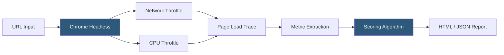

**Category:** Accessibility & Performance Tools
**Difficulty:** Beginner
**Reading time:** 6 min read

---

Lighthouse is an open-source automated auditing tool built by Google that measures web page quality across five categories: Performance, Accessibility, Best Practices, SEO, and Progressive Web App readiness. It runs in Chrome DevTools, as a CLI tool, or via API, making it accessible to both developers and non-technical stakeholders.

- **Performance Score** — a weighted composite of Core Web Vitals and other timing metrics, scored 0–100
- **Largest Contentful Paint (LCP)** — measures loading performance; time until the largest visible content element renders (good: under 2.5s)
- **Total Blocking Time (TBT)** — measures interactivity; total time main thread is blocked during page load (good: under 200ms)
- **Cumulative Layout Shift (CLS)** — measures visual stability; quantifies unexpected layout shifts (good: under 0.1)
- **Throttling** — Lighthouse simulates mobile CPU and 4G network conditions to approximate real-user experience
- **Opportunity** — a specific optimization Lighthouse identifies with an estimated time savings if fixed

When you run a Lighthouse audit, Chrome launches a controlled headless browser session with simulated throttling (equivalent to a mid-tier Android phone on a fast 4G connection by default). It captures a detailed performance trace while the page loads, including timestamps for every network request, main-thread task, and paint event.

After the trace is collected, Lighthouse extracts raw metric values: LCP timestamp, Total Blocking Time (sum of long task durations minus 50ms), CLS score, and others. These raw values are converted to scores using log-normal distributions calibrated against real-world data from HTTP Archive. A score of 90+ is green, 50–89 orange, below 50 red.

The Opportunities section shows actionable optimizations with estimated load time savings — things like unused JavaScript, render-blocking resources, or uncompressed images. The Diagnostics section provides additional detail without time-saving estimates. Each finding links to documentation explaining why it matters and how to fix it.

Lighthouse's accessibility audit uses axe-core under the hood, running the same engine as axe DevTools against the rendered DOM.

For CI integration, the Lighthouse CLI accepts flags for custom throttling profiles, output formats (JSON, HTML, CSV), and minimum score thresholds — allowing you to fail builds when performance drops below a defined threshold.

- Pre-deployment performance baseline — establish a score before and after changes
- Image optimization triage — identify specific images contributing to slow LCP
- CI/CD performance budgets — fail builds if the performance score drops below 80
- SEO audit — confirm pages are crawlable and have proper meta tags, structured data, and mobile layout

| Advantage | Disadvantage |
|-----------|--------------|
| Free and built into Chrome DevTools | Simulated throttling differs from real-device measurements |
| Covers performance, accessibility, SEO, and PWA in one tool | Lab data does not capture real-user network diversity |
| Open-source and extensible via custom audits | Scores vary between runs due to CPU contention on the test machine |
| Integrates with PageSpeed Insights API for monitoring | Accessibility audit only catches ~30% of real WCAG failures |

- [Google PageSpeed Insights](google-pagespeed-insights.md)
- [Core Web Vitals Checker](core-web-vitals-checker.md)
- [WebPageTest Performance Testing](webpagetest-performance-testing.md)

---
*Part of the [Accessibility & Performance Tools](index.md) category · [Back to Master Index](../../index.md)*
