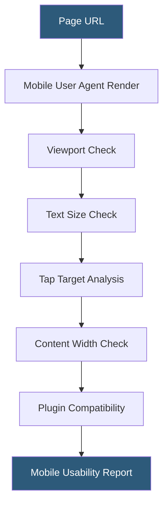

**Category:** Accessibility & Performance Tools
**Difficulty:** Beginner
**Reading time:** 5 min read

---

Mobile-friendly testing evaluates whether a web page renders correctly on small screens and touch interfaces, checking viewport configuration, text legibility, tap target sizing, and content scaling. It matters because mobile devices account for over 60% of global web traffic and Google uses mobile-first indexing, making mobile compatibility a direct ranking factor.

- **Viewport meta tag** — `<meta name="viewport" content="width=device-width, initial-scale=1">` that tells browsers to scale content to the device screen width
- **Tap target size** — the minimum 44x44 CSS pixel area recommended for interactive elements to prevent mis-taps on touchscreens
- **Mobile-first indexing** — Google's practice of using the mobile version of page content for indexing and ranking
- **Responsive design** — CSS-based layout adaptation using media queries, flexible grids, and fluid images rather than separate mobile URLs
- **Google Mobile-Friendly Test** — Google's official tool (search.google.com/test/mobile-friendly) that renders a page with a mobile user agent and reports usability issues

Google's Mobile-Friendly Test renders the page using a Googlebot smartphone user agent with a 360x640 viewport. The rendering engine evaluates five categories: viewport configuration (checking for the correct meta viewport tag), text size (body text should be at least 12px computed size), tap target spacing (interactive elements should not be closer than 8px), content width (content should not require horizontal scrolling on a 320px viewport), and plugin usage (Flash and other unsupported plugins fail automatically).

The tool returns a pass/fail verdict along with screenshots of how Googlebot renders the page. Failed items link to Google's documentation with specific remediation guidance. For large sites, the Google Search Console Mobile Usability report aggregates mobile-friendliness data across all crawled pages, making it practical to identify systemic issues.

Beyond Google's tool, device emulation in Chrome DevTools and responsive design checkers simulate dozens of device viewport sizes and pixel densities simultaneously. Chromium's mobile simulation mode also throttles CPU and network to approximate real device performance. Tools like BrowserStack and LambdaTest go further with real-device testing on actual iOS and Android hardware, catching OS-specific rendering differences that emulation misses.

- SEO audit confirming all landing pages pass Google Mobile-Friendly Test before a PPC campaign launch
- Development workflow check using Chrome DevTools device emulation during feature development
- Post-redesign validation confirming no regression in mobile usability after CSS refactor
- Identifying tap target problems in a navigation menu after converting from desktop-only to responsive layout

| Advantage | Disadvantage |
|-----------|--------------|
| Direct correlation between test results and Google search rankings | Google's test uses a single viewport size and may miss edge cases on other devices |
| Free official testing with no account required | Emulation does not capture all real device hardware and OS differences |
| Chrome DevTools emulation requires no external service | Animated content and complex interactions may behave differently on real hardware |

- [Responsive Design Checker](responsive-design-checker.md)
- [Cross-Browser Testing](cross-browser-testing.md)
- [Core Web Vitals Checker](core-web-vitals-checker.md)

---
*Part of the [Accessibility & Performance Tools](index.md) category · [Back to Master Index](../../index.md)*
