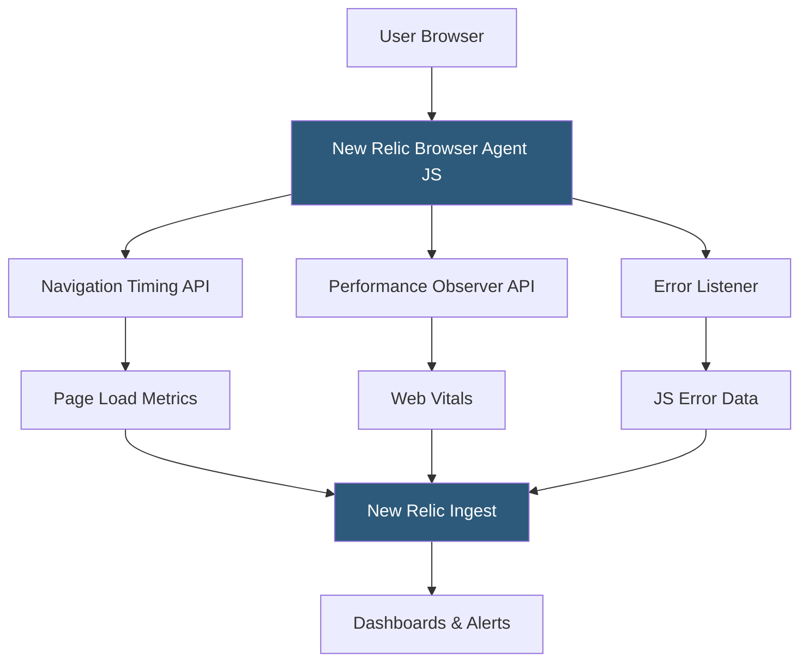

**Category:** Accessibility & Performance Tools
**Difficulty:** Intermediate
**Reading time:** 6 min read

---

New Relic Browser Monitoring is a Real User Monitoring (RUM) solution that instruments actual visitor browsers to collect performance data, JavaScript errors, and session traces at scale. Unlike synthetic tools that simulate users, it captures authentic field data from diverse real-world devices and network conditions across your entire user population.

- **Real User Monitoring (RUM)** — performance measurement collected from actual user browsers through injected JavaScript agents
- **Browser Agent** — a small JavaScript snippet embedded in page HTML that captures timing data and reports it to New Relic
- **Session Trace** — a timeline of all page events (navigation, AJAX calls, JS errors, user interactions) for a single user session
- **Core Web Vitals Tracking** — New Relic captures LCP, INP, and CLS from real users, segmented by geography, browser, and device
- **AJAX Monitoring** — the agent intercepts XMLHttpRequest and Fetch calls to measure API call timing and error rates within pages
- **JavaScript Error Tracking** — uncaught exceptions, rejected promises, and caught errors are automatically captured with stack traces

Installing New Relic Browser requires adding a JavaScript snippet to your pages — either inline in the `<head>` element or via an async loader. The snippet initializes the browser agent, which hooks into the browser's Navigation Timing API, PerformanceObserver, and error event listeners.

As each user loads a page, the agent captures: the full page load timeline (DNS, TCP, SSL, TTFB, DOM content loaded, window load), Core Web Vitals as they occur (LCP fires when the largest element paints, CLS accumulates throughout the session, INP measures interaction delays), AJAX request durations and status codes, and any JavaScript exceptions.

This data is batched and sent to New Relic's ingest endpoint asynchronously, with minimal impact on page performance. The data arrives in New Relic within seconds and appears in dashboards, where you can filter by user geography, browser version, device type, and custom attributes.

The Session Trace feature records a waterfall-style timeline of every event in a single session — useful for debugging intermittent issues that are hard to reproduce. You can find a specific user's session by their user ID or session token and replay the exact sequence of events.

New Relic's query language (NRQL) lets you write custom SQL-like queries against browser data — for example: "Show me the 95th percentile LCP for users in Germany on mobile Chrome in the past 24 hours."

- Performance segmentation — discover that mobile users in Southeast Asia have 8-second LCP while desktop US users see 1.5 seconds
- JavaScript error triage — identify which uncaught exception is affecting 5% of users before it triggers a support ticket spike
- AJAX performance monitoring — find which API endpoint is causing slowdowns in your single-page application
- Business impact correlation — correlate Core Web Vitals with conversion rate to make the business case for performance investment

| Advantage | Disadvantage |
|-----------|--------------|
| Real-user data reflects actual experience diversity | Requires JavaScript injection on every page |
| Scales to millions of page views | Data sampling at high traffic volumes may miss rare issues |
| Powerful NRQL querying for custom analysis | Full feature set requires paid New Relic subscription |
| Integrates with full New Relic stack (APM, infrastructure) | Privacy considerations for GDPR compliance of collecting user data |

- [SpeedCurve Performance Monitoring](speedcurve-performance-monitoring.md)
- [Calibre Performance Platform](calibre-performance-platform.md)
- [WebPageTest Performance Testing](webpagetest-performance-testing.md)

---
*Part of the [Accessibility & Performance Tools](index.md) category · [Back to Master Index](../../index.md)*
