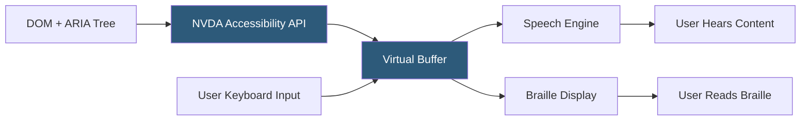

**Category:** Accessibility & Performance Tools
**Difficulty:** Intermediate
**Reading time:** 6 min read

---

NVDA (NonVisual Desktop Access) is a free, open-source screen reader for Windows that reads screen content aloud and converts it to braille output. For web developers, testing with NVDA is essential because it reveals how semantic HTML, ARIA roles, and focus management translate into the actual audio experience for blind and low-vision users.

- **Screen Reader** — software that interprets on-screen content and outputs it as synthesized speech or braille, enabling users without functional vision to use computers
- **Virtual Browse Mode** — NVDA's default mode for reading web content; the user arrows through the page reading headings, links, form controls, and paragraphs in DOM order
- **Forms Mode / Application Mode** — mode activated when NVDA enters a form or web application, allowing keyboard events to pass through to the application rather than being intercepted by NVDA
- **NVDA + Browse Key** — NVDA's modifier key (Insert on desktop keyboards) combined with single letters to jump between headings (H), links (K), form fields (F), and landmarks (D)
- **Accessible Name** — the text NVDA announces for an element; derived from label, aria-label, aria-labelledby, or title attributes
- **ARIA Live Regions** — HTML attributes (`aria-live`, `aria-relevant`) that cause NVDA to announce dynamic content changes without requiring user navigation

NVDA uses Windows accessibility APIs (MSAA, IAccessible2, UI Automation) to access the rendered accessibility tree — a simplified version of the DOM that browsers expose containing only semantically meaningful elements with their names, roles, states, and values. NVDA builds an internal Virtual Buffer from this tree, allowing users to read and navigate web content independently of the visual layout.

When a user arrives on a page, NVDA reads the page title and begins reading content sequentially. Quick navigation keys let users jump to headings (H), links (K), form controls (F, R, C for radio buttons/checkboxes), tables (T), and ARIA landmarks (D for document landmarks). This navigation model means heading hierarchy is critical — an `<h2>` inside a modal that should logically be `<h3>` disrupts the heading tree NVDA users rely on.

Testing with NVDA involves verifying: images have meaningful alt text (or empty alt="" if decorative), form inputs have associated labels, buttons have descriptive names, modals trap focus and announce their title, live regions announce dynamic content updates, and the page is navigable without a mouse.

The most common NVDA + browser combination for testing is NVDA with Firefox, as this pair has the broadest ARIA support. Chrome + NVDA is also tested as it represents a growing usage share.

- Verifying form accessibility — confirm labels are announced, error messages are associated, and validation feedback is announced via live regions
- Modal and dialog testing — verify focus moves into the modal, is trapped within it, and returns to the trigger on close
- Dynamic content testing — confirm that AJAX-loaded content is announced without requiring page refresh
- ARIA implementation verification — test whether custom widgets built with ARIA roles (combobox, listbox, tree) behave as expected under NVDA

| Advantage | Disadvantage |
|-----------|--------------|
| Free and the most-used screen reader globally for testing | Windows only; requires a Windows machine or VM |
| Real-world testing catches issues automated tools miss | Steep learning curve; requires significant practice to test effectively |
| Open-source with active development | NVDA + browser + ARIA compatibility matrix is complex |
| Supports braille displays for combined testing | Test results may differ between NVDA versions |

- [JAWS Screen Reader](jaws-screen-reader.md)
- [axe DevTools Accessibility](axe-devtools-accessibility.md)
- [Accessibility Insights Testing](accessibility-insights-testing.md)

---
*Part of the [Accessibility & Performance Tools](index.md) category · [Back to Master Index](../../index.md)*
