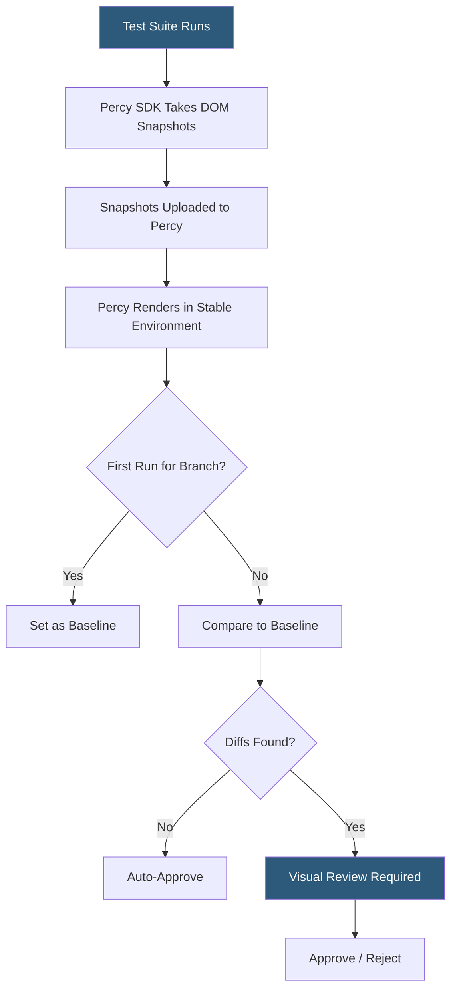

**Category:** Accessibility & Performance Tools
**Difficulty:** Intermediate
**Reading time:** 6 min read

---

Percy (by BrowserStack) is a visual review platform that captures DOM snapshots during test runs and renders them in a stabilized environment for cross-browser visual comparison, enabling teams to detect unintended UI changes. It matters because traditional assertion-based tests cannot catch visual regressions like shifted layouts, color changes, or missing elements that break user experience without triggering functional failures.

- **Visual snapshot** — a serialized DOM and asset capture taken during a test run that Percy renders in its own browser environment for consistency
- **Baseline** — the approved screenshot state against which future snapshots are compared; the first snapshot for a branch becomes the baseline
- **Diff** — a pixel-level comparison highlighting changed regions between the current snapshot and the baseline
- **Perceptual diff** — Percy's rendering approach that accounts for anti-aliasing and subpixel rendering differences, reducing false positives compared to raw pixel comparison
- **Review workflow** — the PR-integrated approval flow where team members accept or reject visual diffs before a pull request can merge

Percy's architecture solves the test environment flakiness problem by separating snapshot capture from rendering. During a test run, the Percy SDK serializes the live DOM (including computed styles, fonts, and images) into a self-contained snapshot asset rather than taking a raw screenshot. This snapshot is uploaded to Percy's cloud where it is rendered in a controlled, deterministic Chromium environment. Because rendering happens server-side in a consistent environment, differences in local machine fonts, GPU rendering, or animation timing do not cause false positives.

Percy captures diffs at multiple viewport widths (configurable, e.g., 375px, 1280px) and in multiple browsers if enabled. Diff visualization in the Percy UI overlays a color heat map on changed regions, with a slider to compare before/after states. Large diffs from expected design changes (intentional redesigns) are approved with a single click, setting a new baseline.

Integration is achieved through SDKs for Cypress (`@percy/cypress`), Playwright (`@percy/playwright`), Selenium (`@percy/selenium-webdriver`), Storybook (`@percy/storybook`), and popular frameworks. The Storybook integration is especially powerful for component libraries — it automatically snapshots every story across all configured viewports, giving visual coverage of the entire component inventory.

Percy integrates with GitHub, GitLab, and Bitbucket pull requests, posting a required status check that blocks merges until all visual diffs have been reviewed and approved.

- Component library teams running Percy against all Storybook stories to catch regressions after a design token change
- E-commerce sites capturing product page snapshots at checkout steps to catch layout shifts between deploys
- Design system teams requiring visual approval from designers before CSS changes can merge
- Cross-browser visual consistency checks comparing Chrome and Firefox renders of the same page

| Advantage | Disadvantage |
|-----------|--------------|
| Deterministic rendering eliminates environment-based flakiness | Review workflow can become a bottleneck if diffs are frequent and reviewers are slow |
| PR integration enforces visual review as a merge gate | Snapshots capture DOM state, not animation or hover states without special handling |
| Storybook integration provides broad component coverage efficiently | Cost scales with snapshot volume; large test suites accumulate snapshot charges quickly |

- [Applitools Visual AI](applitools-visual-ai.md)
- [BackstopJS Visual Regression](backstopjs-visual-regression.md)
- [Cross-Browser Testing](cross-browser-testing.md)

---
*Part of the [Accessibility & Performance Tools](index.md) category · [Back to Master Index](../../index.md)*
