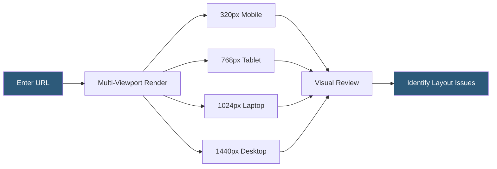

**Category:** Accessibility & Performance Tools
**Difficulty:** Beginner
**Reading time:** 5 min read

---

Responsive design checkers simulate how a website renders across multiple viewport sizes simultaneously, helping developers verify that layouts adapt correctly from mobile to desktop without manual device switching. They matter because responsive design bugs — text overflow, overlapping elements, and broken navigation — are often only visible at specific breakpoint widths that developers may not test during local development.

- **Breakpoint** — a CSS media query threshold (e.g., 768px, 1024px) at which the layout changes to accommodate different screen sizes
- **Viewport** — the visible area of the browser window, defined by width and height in CSS pixels
- **Fluid layout** — a design that uses percentage-based widths and flexbox/grid so elements scale proportionally between breakpoints
- **Device pixel ratio (DPR)** — the ratio of physical pixels to CSS pixels on high-resolution displays like Retina screens, affecting image sharpness
- **Multi-viewport preview** — a tool that renders the same URL in several viewport widths side by side for simultaneous comparison

Responsive design checkers operate by resizing an iframe or headless browser window to target viewport dimensions and capturing a screenshot or live render. Tools like Responsively App and Am I Responsive run a page simultaneously in several viewport widths — typically 320px (small mobile), 480px (large mobile), 768px (tablet), 1024px (laptop), and 1440px (wide desktop) — displaying each as a synchronized pane where scrolling in one panel scrolls all others.

Browser-native options include Chrome DevTools' device toolbar (Ctrl+Shift+M), which lets developers drag the viewport edge to any custom width, enabling inspection of layout behavior at any breakpoint. The DevTools responsive mode also emulates device pixel ratios, letting developers preview how retina images appear on high-DPI displays. Firefox's Responsive Design Mode offers similar capabilities plus touch event simulation.

Online tools like Responsinator.com and ScreenFly embed the target URL in iframes resized to common device dimensions. These are useful for quick checks but limited by X-Frame-Options headers — many modern sites block iframe embedding, requiring a browser extension or local proxy to bypass the restriction. For teams doing systematic responsive QA, Playwright and Cypress enable automated visual regression testing across multiple viewport configurations, capturing screenshots and diffing them against baseline images.

- Development check during feature work to verify a new component adapts correctly across breakpoints
- Pre-launch QA sweep covering the most common device viewport sizes before a site goes live
- Visual regression testing in CI comparing screenshots at 320px, 768px, and 1440px after CSS changes
- Identifying a broken navigation at 375px width that collapses incorrectly on iPhone screens

| Advantage | Disadvantage |
|-----------|--------------|
| Checks multiple viewports simultaneously, faster than switching devices manually | Iframe-based tools are blocked by many modern sites' X-Frame-Options headers |
| Browser DevTools are free and require no external service | Emulation does not capture OS-level font rendering or hardware-accelerated CSS differences |
| Automated viewport tests in CI catch regressions proactively | Custom device configurations (foldables, ultrawide monitors) require extra setup |

- [Mobile-Friendly Testing](mobile-friendly-testing.md)
- [Cross-Browser Testing](cross-browser-testing.md)
- [BrowserStack Live Testing](browserstack-live-testing.md)

---
*Part of the [Accessibility & Performance Tools](index.md) category · [Back to Master Index](../../index.md)*
