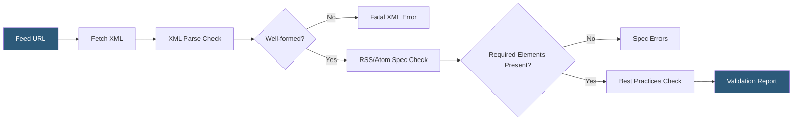

**Category:** Accessibility & Performance Tools
**Difficulty:** Beginner
**Reading time:** 5 min read

---

RSS feed validators check syndication feed XML files (RSS 2.0, Atom 1.0) for conformance to their respective specifications, ensuring feed readers and aggregators can parse and display content without errors. It matters because malformed feeds silently break content distribution to subscribers and automated pipelines that consume feed data.

- **RSS 2.0** — the widely used XML syndication format with required channel elements (`title`, `link`, `description`) and optional item metadata
- **Atom 1.0** — the IETF-standardized syndication format (RFC 4287) with stricter requirements and better internationalization support than RSS 2.0
- **Well-formed XML** — a prerequisite for any valid feed; unescaped `&` characters or missing closing tags invalidate the entire document
- **Feed autodiscovery** — `<link rel="alternate" type="application/rss+xml">` tags in HTML that let browsers and aggregators find feeds automatically
- **W3C Feed Validator** — the canonical validation service at validator.w3.org/feed that checks both RSS and Atom feeds

The W3C Feed Validator fetches a feed URL, first checking that the XML is well-formed — a hard requirement before any semantic validation can proceed. Common XML failures include unescaped HTML entities in description fields (`&` must be `&amp;`), CDATA sections with raw `]]>` sequences, and encoding declarations that conflict with the actual file encoding.

After XML parsing succeeds, the validator checks for required elements. RSS 2.0 feeds must include `<channel>` elements `<title>`, `<link>`, and `<description>`. Each `<item>` must have at least `<title>` or `<description>`. The Atom path is stricter: each `<entry>` must include an `<id>` (a permanent, unique IRI), a `<title>`, and an `<updated>` timestamp. Missing or duplicate GUIDs are flagged as errors because they break incremental feed reader updates.

Warnings highlight best-practice violations: dates not in RFC 822 (RSS) or RFC 3339 (Atom) format, missing `<pubDate>` on items (causing feed readers to guess ordering), and HTTP response headers lacking correct MIME types (`application/rss+xml` or `application/atom+xml`). The validator also checks autodiscovery link syntax in HTML.

- Blog and CMS operators validating feeds after CMS upgrades break XML escaping
- Podcast publishers validating iTunes-extended RSS feeds before directory submission
- Content aggregation platforms checking upstream feeds before ingestion
- News organizations ensuring valid Atom feeds for Google News inclusion

| Advantage | Disadvantage |
|-----------|--------------|
| Prevents silent distribution failures to feed subscribers | Does not validate feed content quality or image dimensions |
| Free, no account required | Cannot validate password-protected or IP-restricted feeds via public service |
| Checks both RSS and Atom with the same tool | Some feed extensions (iTunes, Media RSS) require specialized validators |

- [Structured Data Testing](structured-data-testing.md)
- [W3C HTML Validator](w3c-html-validator.md)
- [Schema Markup Validator](schema-markup-validator.md)

---
*Part of the [Accessibility & Performance Tools](index.md) category · [Back to Master Index](../../index.md)*
