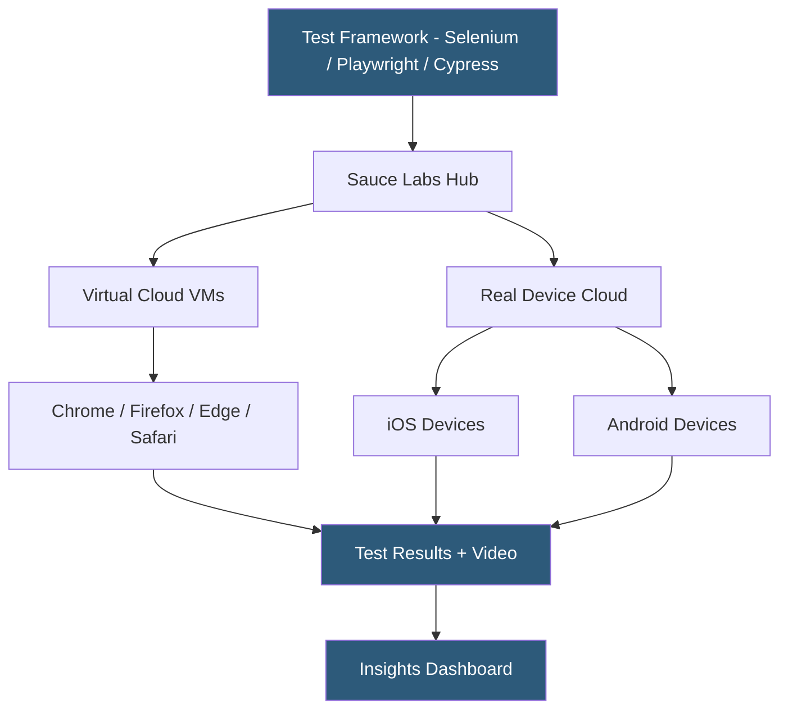

**Category:** Accessibility & Performance Tools
**Difficulty:** Intermediate
**Reading time:** 6 min read

---

Sauce Labs is a cloud-based continuous testing platform providing automated and manual testing across a large matrix of browsers, operating systems, and mobile devices, with deep CI/CD integration and test analytics. It matters for teams that need scalable automated cross-browser testing integrated into delivery pipelines, particularly those already using Selenium, Cypress, or Playwright.

- **Sauce Labs Virtual Cloud** — VM-based browser testing with low provisioning latency for automated test suites
- **Sauce Labs Real Device Cloud** — physical Android and iOS devices for manual and automated mobile testing
- **saucelabs.yml** — the configuration file defining browser-OS combinations, test concurrency limits, and tunnel settings
- **Sauce Connect Proxy** — the encrypted tunnel tool analogous to BrowserStack Local, enabling tests against internal environments
- **Test analytics** — Sauce Labs Insights dashboard showing test history, failure trends, flakiness scores, and build health over time

Sauce Labs provides a Selenium Grid-compatible hub endpoint. Teams point their WebDriver `remoteUrl` at `ondemand.saucelabs.com` and pass credentials and desired capabilities (browser name, browser version, OS) as capabilities in the test configuration. Sauce Labs provisions the matching VM or real device, executes the test, and streams video, screenshots, and logs back to the Sauce Labs dashboard.

For modern frameworks, Sauce Labs supports Playwright natively via the `@playwright/test` configuration's `--browser-channel` pointing to Sauce infrastructure, and Cypress via the official `saucectl` CLI wrapper. The `saucectl` tool reads a `sauce.yml` configuration and submits test bundles to Sauce's infrastructure for parallel execution across multiple browser-OS combinations defined in the config matrix.

Sauce Labs' test analytics layer collects result history across all runs and builds, allowing teams to calculate a "flakiness score" per test — tests that sometimes pass and sometimes fail without code changes. The platform tracks failure trends over time, enabling identification of unreliable tests that should be quarantined or fixed before they pollute CI signal. Error categorization groups failures by type (timeout, element not found, JavaScript error) to speed up debugging.

- Enterprise teams running 500+ parallel automated browser tests across a 20-browser matrix in under 10 minutes
- Mobile teams validating a React Native app's web view on 15 real Android device-OS combinations
- QA organizations using Sauce Insights to identify the five most flaky tests blocking daily builds
- Teams using Sauce Connect to run automated regression suites against a staging environment behind a corporate VPN

| Advantage | Disadvantage |
|-----------|--------------|
| Deep CI integration with Jenkins, GitHub Actions, Azure DevOps out of the box | Higher cost than simpler alternatives; enterprise pricing for large concurrency |
| Test analytics and flakiness detection reduce debugging time | Configuration complexity increases with large browser-OS matrices |
| saucectl simplifies Cypress and Playwright cloud execution | Real device availability for older iOS versions can be limited |

- [BrowserStack Live Testing](browserstack-live-testing.md)
- [LambdaTest Cross-Browser](lambdatest-cross-browser.md)
- [Cross-Browser Testing](cross-browser-testing.md)

---
*Part of the [Accessibility & Performance Tools](index.md) category · [Back to Master Index](../../index.md)*
