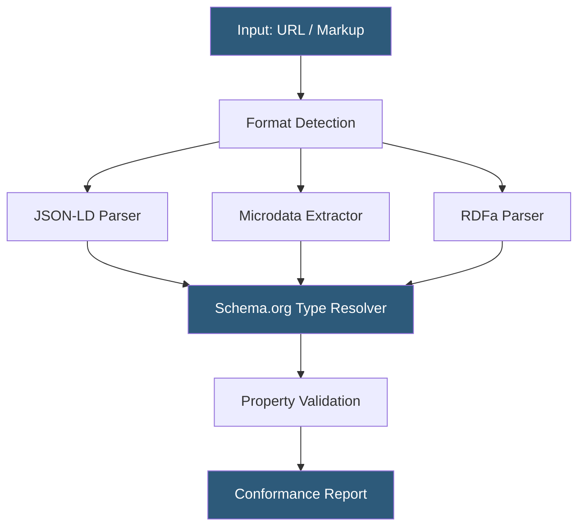

**Category:** Accessibility & Performance Tools
**Difficulty:** Intermediate
**Reading time:** 5 min read

---

The Schema Markup Validator (validator.schema.org) is the official tool for verifying that structured data correctly implements the full Schema.org vocabulary, covering entity types beyond those eligible for Google rich results. It matters because it provides an authoritative conformance baseline independent of any single search engine's interpretation of structured data.

- **Schema.org type hierarchy** — a class inheritance tree where specific types (e.g., `LodgingBusiness`) inherit properties from broader types (e.g., `LocalBusiness`, `Organization`, `Thing`)
- **Mandatory property** — a property marked `required` in the Schema.org definition; absence is an error
- **Expected type** — each property has a declared value type (Text, URL, Number, nested entity); passing the wrong type is a type error
- **Structured data formats** — Schema.org supports JSON-LD, Microdata, and RDFa; the validator handles all three
- **Conformance level** — Schema.org conformance vs. Google rich result eligibility are separate; a Schema.org-valid markup may still fail Google's implementation guidelines

The validator.schema.org tool operates by first detecting which structured data format is embedded in the target page, then extracting all entity declarations and resolving each against the Schema.org type hierarchy. For each property on an entity, the validator checks that the value matches the expected type — for example, `url` must be a valid URL string, `telephone` must be a Text, and `openingHours` must follow a specific day-of-week format pattern.

The tool presents results in a side-by-side view: the raw markup alongside an annotated entity tree showing which properties are present, their inferred types, and any errors or warnings. It can handle complex nested entities, such as a `Product` containing multiple `Offer` objects each with `PriceSpecification` children, validating the entire graph in a single pass.

Unlike Google's Rich Results Test, Schema Markup Validator covers entity types that search engines use internally but do not expose as visual rich results — such as `HealthcareOrganization`, `LegalService`, or `SoftwareApplication`. Organizations building knowledge graphs or submitting entity data to search engines use the validator to ensure complete and accurate type coverage. For automated testing, the `schemarama` npm library wraps the same validation logic and can be integrated into deployment pipelines.

- Healthcare organizations validating `MedicalClinic` and `Physician` markup for Google Health knowledge panels
- SaaS companies verifying `SoftwareApplication` markup for App Store structured results
- Knowledge graph publishers checking entity markup before batch submission
- Technical SEO audits covering all entity types on large sites with thousands of structured data nodes

| Advantage | Disadvantage |
|-----------|--------------|
| Authoritative against full Schema.org vocabulary, not just Google's subset | Does not test whether Google or other engines will actually render rich results |
| Validates all three structured data formats (JSON-LD, Microdata, RDFa) | Requires public URL access; cannot test authenticated pages directly |
| Free, maintained by Schema.org consortium | Some proprietary schema extensions used by specific engines are not validated |

- [Structured Data Testing](structured-data-testing.md)
- [W3C HTML Validator](w3c-html-validator.md)
- [Google PageSpeed Insights](google-pagespeed-insights.md)

---
*Part of the [Accessibility & Performance Tools](index.md) category · [Back to Master Index](../../index.md)*
