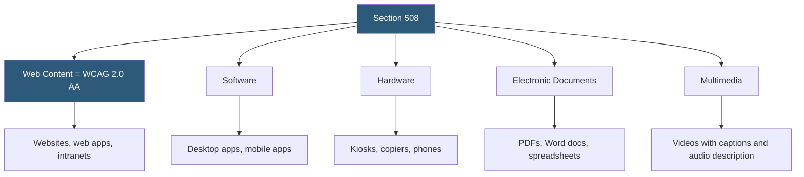

**Category:** Accessibility & Performance Tools
**Difficulty:** Intermediate
**Reading time:** 6 min read

---

Section 508 is a U.S. federal law requiring that electronic and information technology developed, procured, maintained, or used by federal agencies be accessible to people with disabilities. Revised in 2018 to incorporate WCAG 2.0 Level AA as its technical standard, Section 508 compliance testing is required for all U.S. federal government web properties and frequently required in government contracting.

- **Section 508 of the Rehabilitation Act** — the federal statute (29 U.S.C. § 794d) requiring accessible ICT for federal agencies
- **Revised 508 Standards (2018)** — the updated regulations incorporating WCAG 2.0 Level AA and harmonizing with the European EN 301 549 standard
- **ICT (Information and Communications Technology)** — the broad category covered: websites, software, hardware, electronic documents, multimedia, and telecommunications
- **VPAT (Voluntary Product Accessibility Template)** — a standardized form documenting how a product meets 508/WCAG requirements; required for federal procurement bids
- **ACR (Accessibility Conformance Report)** — the completed VPAT document; must be current and accurate
- **Section 508 Testing** — follows the same technical tests as WCAG 2.0 AA, with additional requirements for hardware, software, and closed functionality

Section 508 compliance for web content is technically equivalent to WCAG 2.0 Level AA — the 2018 update explicitly incorporated WCAG 2.0 as the technical standard. In practice, federal agencies test against WCAG 2.1 AA since it is backward compatible with 2.0 AA.

Federal agencies use the Trusted Tester Program (developed by DHS) as the standardized testing methodology. Trusted Testers follow a specific test process using a defined set of tools and techniques, producing a reproducible result that can be independently verified. The Trusted Tester process uses primarily keyboard testing, visual inspection, and NVDA screen reader testing.

For web vendors selling to the federal government, a VPAT is the required deliverable documenting compliance. The VPAT 2.5 (current version) includes sections for WCAG 2.x web criteria, WCAG non-web software criteria, and functional performance criteria (usable without vision, without hearing, etc.). Each criterion is rated: "Supports", "Partially Supports", "Does Not Support", or "Not Applicable", with explanatory remarks.

The process of completing an accurate VPAT requires the same combination of automated testing, manual testing, and assistive technology testing used for WCAG auditing, but the output format is standardized for government procurement review.

Federal agency websites must publish an accessibility statement and VPAT, provide a feedback mechanism for users to report accessibility problems, and respond to requests for accessible formats within specific timeframes.

- Government contractor qualification — VPAT required for software and SaaS products sold to U.S. federal agencies
- Federal agency website compliance — ongoing testing and remediation programs
- State and local government compliance — many states have adopted Section 508 or equivalent standards
- Educational institution compliance — universities receiving federal funding must comply

| Advantage | Disadvantage |
|-----------|--------------|
| Alignment with WCAG 2.0 AA means existing WCAG tools and training apply | VPAT documentation process is time-consuming and requires specialized knowledge |
| Trusted Tester methodology provides consistent, reproducible results | Section 508 doesn't cover all accessibility contexts (only federal procurements) |
| Harmonized with EN 301 549 for international alignment | VPATs can be inaccurate; no independent verification requirement |
| Clear legal mandate drives investment in accessibility | Broader scope (hardware, software, documents) requires multi-disciplinary expertise |

- [WCAG 2.1 Compliance Testing](wcag-21-compliance-testing.md)
- [ADA Compliance Auditing](ada-compliance-auditing.md)
- [axe DevTools Accessibility](axe-devtools-accessibility.md)

---
*Part of the [Accessibility & Performance Tools](index.md) category · [Back to Master Index](../../index.md)*
