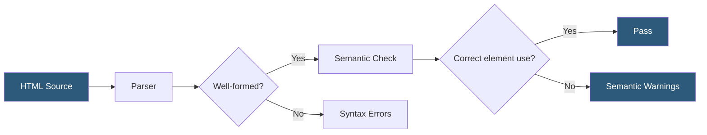

**Category:** Accessibility & Performance Tools
**Difficulty:** Beginner
**Reading time:** 5 min read

---

Semantic HTML validation verifies that markup uses HTML elements according to their intended meaning rather than purely for visual styling, ensuring screen readers and search engines can correctly interpret page structure. It matters because improper element usage silently breaks assistive technology experiences for millions of users.

- **Semantic element** — an HTML tag that conveys meaning about its content, such as `<nav>`, `<article>`, `<aside>`, or `<button>` rather than a generic `
`
- **Heading hierarchy** — the logical `h1`–`h6` nesting structure that screen reader users rely on to navigate page sections
- **Landmark regions** — HTML5 sectioning elements (`<main>`, `<nav>`, `<header>`, `<footer>`) that define navigable areas in assistive technology
- **ARIA roles** — supplemental attributes that override or extend the implicit semantics of HTML elements when native semantics are insufficient
- **Validator** — a tool that parses HTML and reports deviations from the W3C HTML specification

Semantic HTML validation starts with a conformance check against the W3C HTML specification. The W3C Nu HTML Checker (validator.w3.org) parses markup using the same algorithms browsers use and reports both hard syntax errors and semantic misuse — such as placing block-level elements inside inline elements, or nesting interactive elements like buttons inside anchor tags.

Beyond spec conformance, semantic validation tools check for heading skips (jumping from `<h1>` to `<h3>`), missing landmark regions, form fields without associated `<label>` elements, and interactive elements built from non-interactive tags like `
` rather than native `<button>` elements. Tools like axe-core add this layer of semantic reasoning on top of raw HTML parsing.

Validators operate on either static HTML or live URLs. CI/CD integration typically involves running the nu validator or html-validate npm package against built HTML artifacts in a pre-deploy pipeline stage. Many teams combine this with linting rules (eslint-plugin-jsx-a11y for React projects) to catch semantic errors at the component authoring stage before a build is produced.

- CI pipeline check preventing semantically broken markup from reaching production
- Accessibility audit discovering that a navigation menu is built from `
` elements instead of `<nav>` and `<ul>`
- SEO audit confirming proper heading hierarchy for content indexing
- Developer training tool to enforce semantic coding patterns in a team

| Advantage | Disadvantage |
|-----------|--------------|
| Catches errors early and cheaply in the development lifecycle | Does not test actual assistive technology behavior |
| Improves both accessibility and SEO simultaneously | Some valid semantic choices depend on context that validators cannot assess |
| Free tooling available (W3C validator, html-validate) | Third-party component libraries often produce non-semantic HTML outside developer control |

- [W3C HTML Validator](w3c-html-validator.md)
- [ARIA Landmark Testing](aria-landmark-testing.md)
- [WCAG 2.1 Compliance Testing](wcag-21-compliance-testing.md)

---
*Part of the [Accessibility & Performance Tools](index.md) category · [Back to Master Index](../../index.md)*
