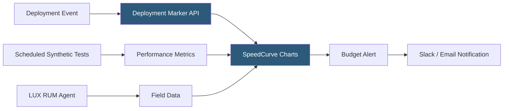

**Category:** Accessibility & Performance Tools
**Difficulty:** Intermediate
**Reading time:** 6 min read

---

SpeedCurve is a performance monitoring platform purpose-built for continuous tracking of web performance over time. It combines synthetic monitoring (Lighthouse and WebPageTest-based lab tests) with Real User Monitoring to give teams a single place to set performance budgets, track Core Web Vitals trends, and correlate performance changes with deployments.

- **Performance Budget** — a defined limit on a performance metric (e.g., LCP must be under 2.5s, page weight under 500KB) that triggers alerts when exceeded
- **Filmstrip Comparison** — side-by-side visual comparison of page load progression between two test runs or dates
- **Favorites** — competitor URLs you configure alongside your own; SpeedCurve tests all pages on the same schedule for direct comparison
- **Deployment Markers** — annotations on time-series charts marking when code was deployed, making it easy to correlate score changes with specific releases
- **LUX (LiveUser eXperience)** — SpeedCurve's Real User Monitoring library that collects field performance data from actual visitors
- **Synthetic Test** — automated Lighthouse/WebPageTest-powered lab test that runs on a defined schedule regardless of real user traffic

SpeedCurve runs scheduled synthetic tests against your configured URLs using WebPageTest infrastructure and Lighthouse. Tests run from your chosen geographic locations at configurable intervals (hourly, daily). Each test produces the full suite of metrics: Core Web Vitals, SpeedIndex, page weight, request count, and more.

The key differentiator is SpeedCurve's charting: all metrics are plotted as time-series charts that persist indefinitely. You can zoom into the past week, compare with the same period last year, or draw a 30-day trend line. Deployment markers — injected via the SpeedCurve API or CI/CD integration — appear as vertical lines on the charts, making before/after comparisons instant.

Performance budgets are configured per metric per URL: "Alert if LCP exceeds 2.5 seconds on the homepage." When a scheduled test returns a result that breaches the budget, SpeedCurve sends an alert. Budgets create a forcing function for teams to fix regressions immediately rather than discovering them weeks later.

The Favorites feature lets you run identical tests against competitor URLs on the same schedule. Charts show your performance alongside competitors', making it easy to justify optimization work or demonstrate market leadership.

LUX (SpeedCurve's RUM library) is a small JS snippet that collects real-user performance data, segmented by country, device, and browser. Combining synthetic (consistent, reproducible) and RUM (real, diverse) data gives a complete picture.

- Performance budget enforcement — block deploys or alert when page weight or LCP budgets are broken
- Competitive benchmarking — track your Core Web Vitals against three direct competitors on a daily basis
- Long-term performance trend analysis — demonstrate year-over-year performance improvement to leadership
- Deployment impact visibility — instantly see if a release caused a 20% LCP regression

| Advantage | Disadvantage |
|-----------|--------------|
| Best-in-class time-series charting for performance trends | Paid tool; pricing based on pages and test frequency |
| Performance budgets with alerting enforce standards | Requires ongoing configuration as site evolves |
| Combines synthetic + RUM in one platform | Synthetic tests may not reflect real user diversity |
| Competitor benchmarking built-in | Learning curve for teams new to performance monitoring |

- [Calibre Performance Platform](calibre-performance-platform.md)
- [WebPageTest Performance Testing](webpagetest-performance-testing.md)
- [Core Web Vitals Checker](core-web-vitals-checker.md)

---
*Part of the [Accessibility & Performance Tools](index.md) category · [Back to Master Index](../../index.md)*
