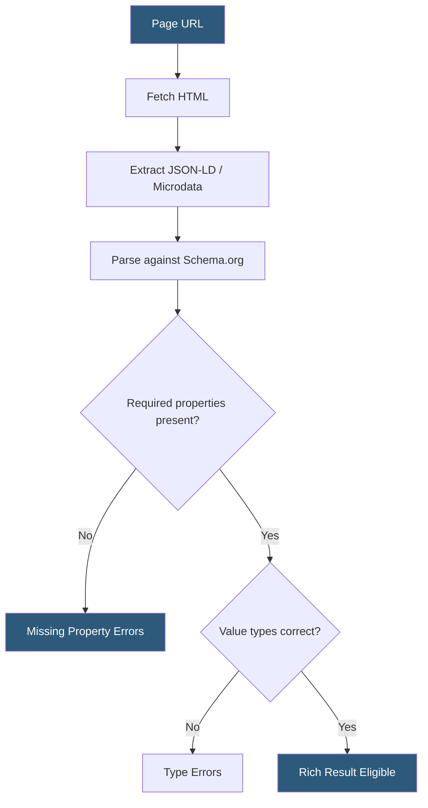

**Category:** Accessibility & Performance Tools
**Difficulty:** Intermediate
**Reading time:** 6 min read

---

Structured data testing validates JSON-LD, Microdata, and RDFa markup against Schema.org vocabulary definitions, verifying that search engines can extract rich result signals like product ratings, FAQs, and event details. It matters because malformed or incomplete structured data prevents rich snippets from appearing in search results, directly affecting click-through rates and organic visibility.

- **Schema.org** — the collaborative vocabulary maintained by Google, Bing, Yahoo, and Yandex that defines entity types (Product, Article, Event, etc.) and their properties
- **JSON-LD** — the recommended embedding format for structured data; a `<script type="application/ld+json">` block in the page `<head>` containing a JSON object
- **Rich result** — an enhanced search engine listing (star ratings, breadcrumbs, FAQs) rendered when valid structured data is present and content meets quality guidelines
- **Required vs recommended properties** — Schema.org properties marked as required by Google's rich result guidelines must be present; recommended properties improve eligibility but are optional
- **Google Rich Results Test** — Google's official tool (search.google.com/test/rich-results) that validates markup against its rich result eligibility criteria specifically

Structured data testing tools fetch a page, extract all embedded structured data blocks, and validate each against the Schema.org type hierarchy. For a `Product` schema, validators check that `name` is a text string, `offers` contains a nested `Offer` object with `price` and `priceCurrency`, and `image` contains an absolute URL or `ImageObject`. Type mismatches — like passing a number where a URL is expected — produce errors even if the markup parses as valid JSON.

Google's Rich Results Test goes beyond Schema.org conformance and checks eligibility against Google-specific implementation guidelines. For example, FAQ rich results require that `acceptedAnswer` contains the full answer text, not a truncated version. The tool renders the page with a headless browser, meaning it evaluates JavaScript-rendered structured data injected dynamically by frameworks like React or Vue.

Schema Markup Validator (validator.schema.org) is the official Schema.org tool and supports all entity types, not just those eligible for Google rich results. It provides a conformance score and property coverage heatmap. For CI integration, teams use the `structured-data-testing-tool` npm package or Google's `schemarama` library to validate JSON-LD in build pipelines.

- E-commerce sites validating Product schema on thousands of product pages to maximize search rich snippets
- News publishers checking Article and NewsArticle markup for Google News inclusion
- Local businesses verifying LocalBusiness schema for Google Maps knowledge panel accuracy
- Recipe sites auditing Recipe markup to qualify for visual recipe rich results

| Advantage | Disadvantage |
|-----------|--------------|
| Directly improves search visibility and CTR when data is correct | Search engines may ignore valid markup if content quality guidelines are not met |
| JSON-LD in `<head>` is easy to maintain separately from HTML | Dynamic structured data rendered by JS requires headless browser testing |
| Free official tools from Google and Schema.org | Markup can be technically valid yet fail rich result criteria due to policy rules |

- [Schema Markup Validator](schema-markup-validator.md)
- [RSS Feed Validator](rss-feed-validator.md)
- [Google PageSpeed Insights](google-pagespeed-insights.md)

---
*Part of the [Accessibility & Performance Tools](index.md) category · [Back to Master Index](../../index.md)*
