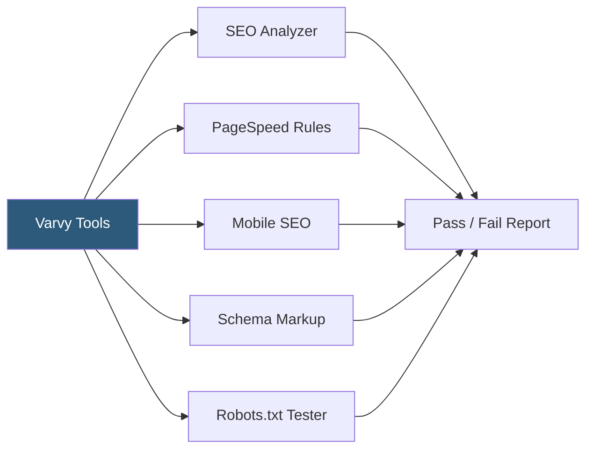

**Category:** Accessibility & Performance Tools
**Difficulty:** Beginner
**Reading time:** 5 min read

---

Varvy is a suite of free web optimization and SEO testing tools that check technical SEO compliance, page speed rules, mobile usability, and accessibility basics. Created by Patrick Sexton, Varvy tools provide plain-English explanations for each check, making them accessible to site owners and content managers without technical backgrounds.

- **Google Guidelines Compliance** — Varvy tests specifically check alignment with Google's webmaster and performance guidelines
- **PageSpeed Rules** — Varvy's speed tool evaluates compression, browser caching, render-blocking resources, and image optimization
- **Mobile Usability** — checks viewport configuration, font sizes, tap target sizes, and content wider than the screen
- **Robots.txt Checker** — verifies robots.txt syntax and checks which Googlebot agents are allowed or disallowed
- **Canonicalization** — Varvy SEO tests verify canonical URLs are set correctly to prevent duplicate content issues
- **Structured Data Validator** — confirms JSON-LD, Microdata, or RDFa markup is present and syntactically correct

Varvy tools operate as free web-based checkers. You enter a URL, select the relevant tool (SEO, speed, mobile, schema), and Varvy fetches and analyzes the page server-side. Each check returns a simple pass/fail with a brief explanation and a link to a plain-English tutorial explaining the concept and how to fix failures.

The SEO tool checks for: HTTPS usage, page speed signals, mobile friendliness, Google Analytics presence, XML sitemap accessibility, robots.txt validity, canonical URL setup, and basic content quality signals like title tag and meta description presence.

The PageSpeed tool evaluates render-blocking resources (synchronous scripts in `<head>`), image compression, browser caching headers on static assets, Gzip/Brotli compression, and CSS/JS minification. Results are organized as visual pass/fail indicators rather than numeric scores.

The robots.txt tester allows you to paste a robots.txt content or enter a URL, then simulate how different Googlebot user agents (Googlebot, Googlebot-Image, Googlebot-Mobile) interpret the rules — identifying accidental blocks on important content.

While Varvy predates the Core Web Vitals era and doesn't surface modern metrics like LCP or CLS, it remains useful for quick technical SEO audits and for teaching SEO fundamentals through its educational explanations.

- Client education — show non-technical clients which basic SEO and speed requirements their site fails
- Quick pre-launch checklist — verify HTTPS, canonical tags, robots.txt, and meta tags before publishing
- Robots.txt debugging — verify that important sections of a site are not accidentally blocked from Googlebot
- Small business site audits — accessible interface for site owners managing their own properties

| Advantage | Disadvantage |
|-----------|--------------|
| Free with no account or limits | Does not measure Core Web Vitals (LCP, INP, CLS) |
| Plain-English explanations suitable for non-technical users | Less comprehensive than Lighthouse or Screaming Frog |
| Educational tutorials accompany each check | Tool suite predates modern web performance standards |
| Quick to use with immediate results | No monitoring or trend tracking |

- [Lighthouse Performance Audit](lighthouse-performance-audit.md)
- [Google PageSpeed Insights](google-pagespeed-insights.md)
- [Schema Markup Validator](schema-markup-validator.md)

---
*Part of the [Accessibility & Performance Tools](index.md) category · [Back to Master Index](../../index.md)*
