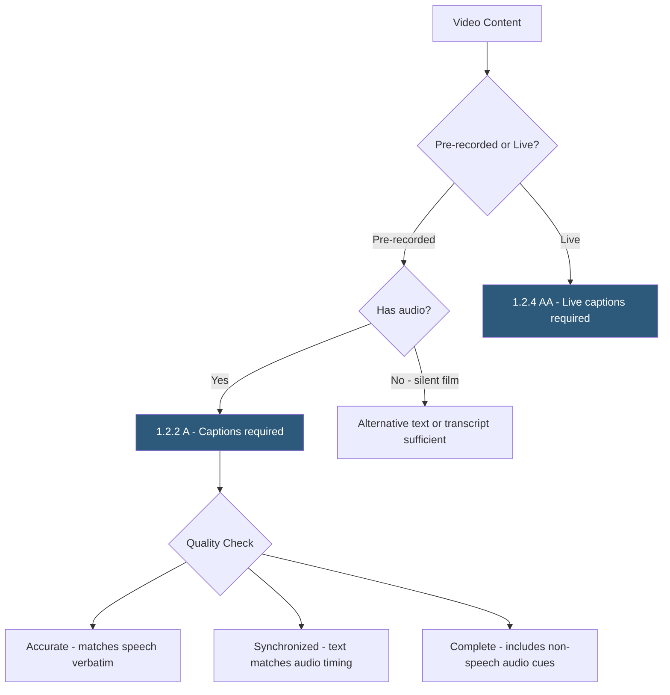

**Category:** Accessibility & Performance Tools
**Difficulty:** Beginner
**Reading time:** 5 min read

---

Video caption compliance testing verifies that videos on web pages have synchronized captions providing equivalent access to audio content for users who are deaf, hard of hearing, or in sound-sensitive environments. WCAG 1.2.2 (Level A) requires captions for pre-recorded synchronized media, making this a fundamental accessibility requirement.

- **Captions** — synchronized text representation of all audio content in a video, including speech, sound effects, and speaker identification; distinct from subtitles which only cover dialogue
- **Closed Captions (CC)** — user-toggled captions embedded in the video player; users can turn them on or off
- **Open Captions** — captions burned directly into the video frame; always visible, cannot be turned off
- **VTT (WebVTT)** — the web standard caption file format used with HTML5 `<video>` elements via the `<track>` element
- **WCAG 1.2.2 Captions (Prerecorded)** — Level A requirement for captions on all pre-recorded synchronized media (audio+video)
- **WCAG 1.2.4 Captions (Live)** — Level AA requirement for captions on live broadcasts; typically met via real-time stenography or ASR

Caption compliance has both presence and quality dimensions. Automated tools can detect whether a video element has a `<track kind="captions">` element attached, but cannot evaluate whether the captions are accurate or synchronized.

For HTML5 video: `<video><track kind="captions" src="captions.vtt" srclang="en" label="English" default></video>`. YouTube videos use YouTube's caption system; ensure manual captions (not just auto-generated) are reviewed for accuracy. Vimeo, Wistia, and other platforms have their own caption upload interfaces.

Caption quality testing involves watching the video with only captions visible (mute the audio), verifying: (1) all speech is accurately transcribed including technical terms, proper nouns, and accents, (2) timestamps are synchronized — captions appear when speech starts and disappear when it ends, (3) non-speech audio is described (e.g., "[applause]", "[door slams]", "[upbeat music]"), (4) multiple speakers are identified ("[Speaker 1:]" or by name), and (5) no content is omitted.

Tools for checking: WAVE and axe detect missing track elements. The W3C's Nu Html Checker flags video elements without tracks. Manual review with auto-captions (YouTube, AWS Transcribe) should include accuracy checking via human review, as automatic captions have 5–15% word error rates in optimal conditions and much higher rates for technical content, accents, or background noise.

- Course and tutorial video compliance — LMS platforms increasingly require captions for legal compliance
- Corporate training content — ADA compliance for employee training materials
- Marketing video audits — verify product demo and explainer videos have captions
- Live webinar planning — arrange live captioning services before recording and publishing

| Advantage | Disadvantage |
|-----------|--------------|
| Automated tools detect completely missing captions | Quality and accuracy require human review of every video |
| VTT format is simple and widely supported | Auto-generated captions may require significant correction |
| Captions benefit SEO (indexed text) and non-native speakers | Captioning large video libraries is time-consuming and expensive |
| Clear WCAG criteria with definitive pass/fail | Live captioning requires real-time stenography services |

- [WCAG 2.1 Compliance Testing](wcag-21-compliance-testing.md)
- [Accessible PDF Checkers](accessible-pdf-checkers.md)
- [WAVE Accessibility Checker](wave-accessibility-checker.md)

---
*Part of the [Accessibility & Performance Tools](index.md) category · [Back to Master Index](../../index.md)*
