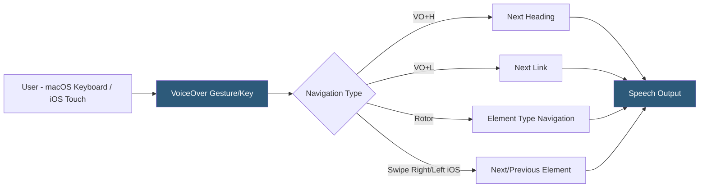

**Category:** Accessibility & Performance Tools
**Difficulty:** Intermediate
**Reading time:** 6 min read

---

VoiceOver is Apple's built-in screen reader available on macOS, iOS, iPadOS, and tvOS. Unlike third-party screen readers, VoiceOver is pre-installed and free, making it the primary accessibility tool for Apple platform users and essential for testing web and app accessibility on Safari and iOS browsers.

- **VoiceOver Rotor** — a virtual dial accessed by rotating two fingers on a trackpad or screen; provides quick navigation by element type (headings, links, form controls, landmarks)
- **VO Keys** — VoiceOver modifier keys (Caps Lock, or Control+Option on Mac) used in combination with other keys for navigation commands
- **QuickNav** — an alternative navigation mode in VoiceOver that enables arrow key navigation without the VO modifier
- **Touch Exploration** — iOS VoiceOver mode where dragging a finger across the screen announces the element under your finger; double-tap to activate
- **Web Content Accessibility** — VoiceOver reads web pages through Safari's accessibility implementation; Chrome on iOS uses WebKit and also works with VoiceOver
- **Accessibility Inspector** — macOS developer tool (separate from VoiceOver) that inspects the accessibility tree of any macOS or iOS application

VoiceOver is tightly integrated with the operating system and browser. On macOS with Safari, VoiceOver reads the browser's accessibility tree via AppleScript and accessibility APIs. When a user navigates to a web page, VoiceOver enters Web mode and reads content in document order, announcing element types (heading level 2, link, button, text field) before the element's text.

On iOS, VoiceOver uses a different interaction paradigm: users explore the screen by dragging a finger to hear what is under it, swipe right to move to the next element, swipe left to move back, and double-tap to activate. The Rotor gesture (rotating two fingers) provides access to navigation categories: headings, links, form controls, tables, and more — equivalent to JAWS/NVDA's quick navigation keys.

Key testing scenarios unique to VoiceOver on iOS include: focus management after modal opens (does focus move into the modal?), gesture-based interactions (does swipe-to-dismiss work with VoiceOver?), and dynamic content announcements (are AJAX updates announced via live regions?).

VoiceOver with Safari on macOS has historically had better web accessibility API support than VoiceOver with Chrome on macOS, though Chrome has improved. The most common mobile testing combination is VoiceOver + Safari on iOS, as this is by far the most used screen reader on mobile devices globally.

- iOS app accessibility testing — required for App Store accessibility compliance and user base that includes VoiceOver users
- Safari compatibility — VoiceOver is the only realistic option for testing Safari-specific accessibility behaviors
- Mobile accessibility verification — swipe navigation testing on touch devices
- Rotor navigation testing — verify headings, landmarks, and links are discoverable through rotor navigation

| Advantage | Disadvantage |
|-----------|--------------|
| Free and pre-installed on all Apple devices | Apple ecosystem only; requires a Mac or iOS device |
| Most popular mobile screen reader (iOS dominates mobile screen reader market) | Different interaction paradigm from Windows screen readers requires separate testing |
| Tightly integrated with Safari for best web compatibility | macOS VoiceOver + Chrome has less reliable ARIA support than JAWS/NVDA |
| Available on macOS, iOS, iPadOS — one tool covers multiple platforms | Complex keyboard commands with a learning curve |

- [NVDA Screen Reader Testing](nvda-screen-reader-testing.md)
- [JAWS Screen Reader](jaws-screen-reader.md)
- [axe DevTools Accessibility](axe-devtools-accessibility.md)

---
*Part of the [Accessibility & Performance Tools](index.md) category · [Back to Master Index](../../index.md)*
