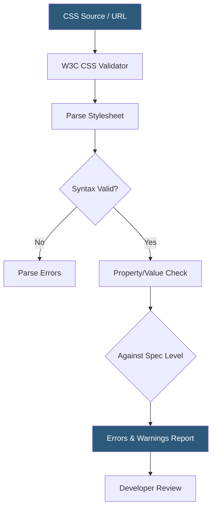

**Category:** Accessibility & Performance Tools
**Difficulty:** Beginner
**Reading time:** 5 min read

---

The W3C CSS Validator (jigsaw.w3.org/css-validator) checks stylesheets for conformance to CSS specifications, identifying property errors, invalid values, and deprecated features that can cause unpredictable cross-browser rendering. It matters because invalid CSS silently degrades visual presentation and can inadvertently remove focus indicators or color contrast that users with disabilities depend on.

- **CSS property error** — an invalid property name or value combination that browsers skip, potentially collapsing a layout silently
- **Parse error** — malformed syntax like missing semicolons or mismatched braces that cause an entire declaration block to be discarded
- **CSS level** — the specification version being validated against (CSS Level 3, CSS 2.1); choosing the right level avoids false positives for newer features
- **Warning** — a valid but potentially problematic CSS pattern such as vendor-prefixed properties without unprefixed equivalents
- **Accessibility-relevant CSS** — style properties that affect usability, including `outline` (focus indicators), `color` and `background-color` contrast, and `font-size` legibility

The W3C CSS Validator accepts input as a URL, file upload, or direct CSS text. It first tokenizes the stylesheet, then validates each rule's selector, property name, and value against the selected CSS specification level. Invalid properties are flagged individually without aborting validation of the rest of the file, giving a complete error list in a single pass.

For web teams, the most accessibility-relevant checks catch cases where `outline: none` or `outline: 0` removes focus indicators without a replacement, and where foreground/background color combinations may produce insufficient contrast — though the validator itself doesn't compute contrast ratios; dedicated tools like the axe engine do that. The validator's warnings also catch vendor-prefixed properties that lack unprefixed counterparts, which can cause features to break as browser support evolves.

The validator exposes a SOAP 1.2 web service API that returns structured XML, making it suitable for automated integration. Teams running static site generators can pipe their compiled CSS through the API in CI pipelines. The output maps each error to a line number and character position, making it straightforward to link errors back to source files.

- CI pipeline CSS quality gate preventing invalid stylesheets from reaching production
- Identifying removed focus styles that break keyboard navigation accessibility
- Verifying vendor-prefix hygiene after upgrading CSS preprocessors
- Educational tool in frontend bootcamps to reinforce correct CSS syntax

| Advantage | Disadvantage |
|-----------|--------------|
| Free, no account required | Does not check computed styles or browser-applied default styles |
| API enables automated pipeline integration | Newer CSS features like `container-queries` trigger false positives in older spec levels |
| Catches cross-browser rendering risks early | Does not test visual output — a valid stylesheet can still look broken |

- [W3C HTML Validator](w3c-html-validator.md)
- [Semantic HTML Validation](semantic-html-validation.md)
- [Color Contrast Analyzers](color-contrast-analyzers.md)

---
*Part of the [Accessibility & Performance Tools](index.md) category · [Back to Master Index](../../index.md)*
