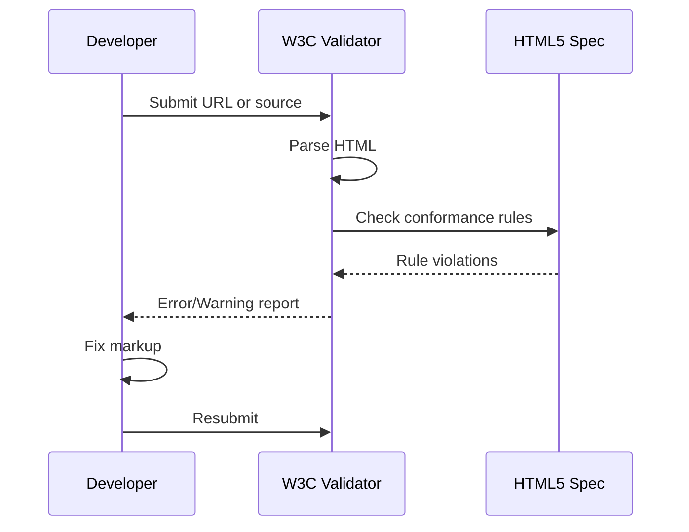

**Category:** Accessibility & Performance Tools
**Difficulty:** Beginner
**Reading time:** 5 min read

---

The W3C HTML Validator (validator.w3.org) is the official tool for checking HTML markup conformance against World Wide Web Consortium specifications, catching syntax errors and semantic misuse before they cause rendering or accessibility problems. It matters because invalid HTML produces inconsistent browser rendering and breaks assistive technology behavior in ways that are hard to diagnose without a conformance baseline.

- **Nu HTML Checker** — the modern W3C validator engine that parses HTML5 using a WHATWG-compliant algorithm and reports both errors and warnings
- **Parse error** — a markup mistake the browser must guess at correcting, such as unclosed tags or illegal nesting
- **Validation error** — a deviation from the HTML specification that may or may not affect rendering
- **Document type declaration** — the `<!DOCTYPE html>` directive that activates standards mode in browsers and determines which specification the validator checks against
- **URI-based validation** — submitting a public URL to the validator rather than pasting source code, which validates the final server-rendered HTML

The Nu HTML Checker uses the same parsing algorithm as modern browsers, meaning it catches errors that the browser silently corrects in ways that may differ across implementations. When a URL is submitted, the validator fetches the HTML via HTTP, strips any HTTP compression, and runs the source through the parser. For each node in the resulting DOM tree, it applies attribute, nesting, and content model rules from the HTML5 specification.

Output is categorized as errors (clear spec violations that must be fixed) or warnings (potentially problematic but context-dependent patterns). Common errors include duplicate IDs, illegal nesting like `
` inside ``, aria attributes on incompatible roles, and required attributes missing from elements like ``. The validator also checks for ARIA usage consistency, flagging cases where roles conflict with native element semantics.

For CI integration, the Nu validator offers a Java-based command-line version and a Docker image (ghcr.io/validator/validator) that accepts stdin or file arguments and outputs JSON, XML, or GNU-style text. Teams pipe output through scripts that fail the build on any error. The validator also exposes a REST endpoint for programmatic single-page validation.

- Pre-deployment HTML quality gate in a continuous integration pipeline
- Accessibility audit baseline confirming markup is parseable before running assistive technology tests
- Legacy site migration check verifying converted pages conform to HTML5 after CMS upgrade
- Developer onboarding tool that teaches correct HTML nesting and attribute usage

| Advantage | Disadvantage |
|-----------|--------------|
| Free, authoritative reference with zero configuration | Does not test runtime behavior or JavaScript-generated markup without special handling |
| Docker image enables offline and CI usage | Server-side rendered pages that require authentication cannot be validated via URI |
| Catches issues browsers silently paper over | Some strict errors have no meaningful user impact, generating noise |

- [Semantic HTML Validation](semantic-html-validation.md)
- [W3C CSS Validator](w3c-css-validator.md)
- [axe DevTools Accessibility](axe-devtools-accessibility.md)

---
*Part of the [Accessibility & Performance Tools](index.md) category · [Back to Master Index](../../index.md)*
