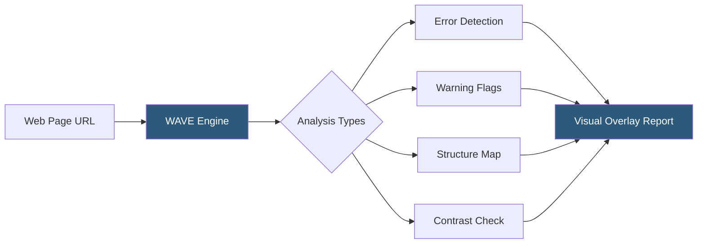

**Category:** Accessibility & Performance Tools
**Difficulty:** Beginner
**Reading time:** 5 min read

---

WAVE is a free web accessibility evaluation tool developed by WebAIM that visually identifies accessibility errors, warnings, and structural elements directly within a web page. It helps developers and content creators find and fix barriers that prevent users with disabilities from accessing web content.

- **Web Accessibility** — the practice of designing websites and applications so people with disabilities can perceive, understand, navigate, and interact with them
- **WCAG** — Web Content Accessibility Guidelines, the international standard defining success criteria for accessible web content
- **Accessibility Error** — a definitive barrier that prevents some users from accessing content, such as missing alt text on images
- **Accessibility Warning** — a potential issue requiring human review to determine if it creates a barrier
- **ARIA** — Accessible Rich Internet Applications, a set of attributes that make dynamic content more accessible to assistive technologies
- **Contrast Ratio** — a numerical measure comparing the luminance of foreground text against its background; WCAG requires at least 4.5:1 for normal text

WAVE injects visual icons and indicators directly into your rendered web page so you can see accessibility issues in context rather than in a separate report. When you submit a URL to wave.webaim.org or use the browser extension, the tool parses the DOM, evaluates HTML semantics, checks ARIA usage, and measures color contrast ratios.

Errors appear as red icons at the exact location of the problem — for example, a red icon over an image with no alt attribute. Alerts (yellow icons) flag items like suspicious alt text or skipped heading levels that need human judgment. Green icons mark structural elements like headings and landmarks, giving you a visual map of page architecture as assistive technology users experience it.

The contrast panel computes the WCAG contrast ratio for every foreground/background color combination found on the page, flagging pairs that fall below 4.5:1 (normal text) or 3:1 (large text). The details panel provides code-level context for each flagged element.

WAVE deliberately does not auto-fix issues because many accessibility decisions require human judgment — a photo without alt text might be decorative (alt="") or informational, and only a human can determine which.

- Pre-launch accessibility audit — verify pages meet WCAG 2.1 AA before publishing
- Developer workflow integration — browser extension allows testing during active development
- Content team training — visual overlays help non-technical editors understand what alt text and headings do
- Compliance documentation — generate reports for accessibility statements or legal review

| Advantage | Disadvantage |
|-----------|--------------|
| Free and requires no account | Cannot catch all accessibility issues (automated tools find ~30–40% of WCAG failures) |
| Visual in-page overlay shows context | Does not test dynamic content loaded after page render |
| Browser extension works on password-protected pages | Commercial API access requires paid WebAIM membership |
| Beginner-friendly with plain-English explanations | No bulk scanning or CI/CD integration in free tier |

- [axe DevTools Accessibility](axe-devtools-accessibility.md)
- [WCAG 2.1 Compliance Testing](wcag-21-compliance-testing.md)
- [Accessibility Insights Testing](accessibility-insights-testing.md)

---
*Part of the [Accessibility & Performance Tools](index.md) category · [Back to Master Index](../../index.md)*
