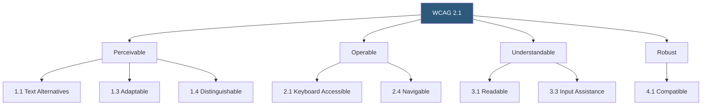

**Category:** Accessibility & Performance Tools
**Difficulty:** Intermediate
**Reading time:** 7 min read

---

WCAG 2.1 (Web Content Accessibility Guidelines 2.1) is the internationally recognized standard for web accessibility, defining 78 success criteria organized under four principles. Compliance testing systematically evaluates web content against these criteria to determine whether it meets Level A, AA, or AAA conformance — the levels required by most accessibility laws worldwide.

- **POUR Principles** — WCAG's four organizing principles: Perceivable, Operable, Understandable, Robust; every success criterion falls under one of these
- **Conformance Level A** — minimum accessibility requirements; 30 criteria that most websites must meet to be usable at all
- **Conformance Level AA** — the most commonly required level; includes Level A plus 20 additional criteria; mandated by ADA, Section 508, EN 301 549, and most national laws
- **Conformance Level AAA** — the highest level; 28 additional criteria; recommended for specific contexts but not required for full conformance
- **Success Criterion** — a specific testable statement (e.g., "1.1.1 Non-text Content: All non-text content has a text alternative") that either passes or fails
- **Sufficient Technique** — a specific implementation approach documented by the W3C that satisfies a success criterion

WCAG 2.1 compliance testing combines automated scanning with structured manual testing and assistive technology testing. No single approach catches all issues.

Automated testing (axe, WAVE, Lighthouse) reliably catches a defined subset of success criteria: missing alt attributes (1.1.1), missing form labels (1.3.1, 1.3.5), insufficient color contrast (1.4.3, 1.4.11), missing language attribute (3.1.1), and parsing errors (4.1.1). Studies consistently show automated tools catch 30–40% of real WCAG failures.

Manual testing covers the remaining criteria: keyboard operability (2.1.1), logical reading/focus order (1.3.2, 2.4.3), link purpose in context (2.4.4), error identification and suggestions (3.3.1, 3.3.3), session timeout warnings (2.2.1), and content that doesn't change on focus (3.2.1). Each manual test follows a defined test procedure documented in the W3C's Understanding WCAG documents.

Assistive technology testing validates ARIA implementation and dynamic content handling: screen reader testing with JAWS, NVDA, and VoiceOver, keyboard navigation testing, and color contrast measurement using sampling tools.

A complete compliance audit documents each success criterion as Pass, Fail, or Not Applicable, with specific instances of failures, their WCAG criterion reference, and remediation guidance. Many organizations use the WCAG-EM (Website Accessibility Conformance Evaluation Methodology) for structured audits.

WCAG 2.2, published in 2023, adds 9 new success criteria including Focus Appearance (2.4.11), Dragging Movements (2.5.7), and Target Size (2.5.8). Most legal requirements currently reference WCAG 2.1 AA, but 2.2 will increasingly be required.

- Legal compliance documentation — produce a VPAT (Voluntary Product Accessibility Template) or accessibility statement
- Pre-launch audit — systematic check before deploying a new site or major feature
- Procurement compliance — many government contracts require WCAG 2.1 AA conformance
- Accessibility remediation prioritization — identify which failures have the most user impact and address in priority order

| Advantage | Disadvantage |
|-----------|--------------|
| International standard accepted by most regulators globally | Passes WCAG doesn't mean genuinely usable for all people with disabilities |
| Hierarchical structure makes partial compliance trackable | Full audit requires significant time and expert knowledge |
| Clear success criteria provide definitive pass/fail | Automated tools only catch a fraction of actual failures |
| WCAG 2.0 AA is backward compatible with 2.1 AA | AAA conformance is difficult to achieve for general-purpose sites |

- [axe DevTools Accessibility](axe-devtools-accessibility.md)
- [Section 508 Compliance](section-508-compliance.md)
- [Accessibility Insights Testing](accessibility-insights-testing.md)

---
*Part of the [Accessibility & Performance Tools](index.md) category · [Back to Master Index](../../index.md)*
