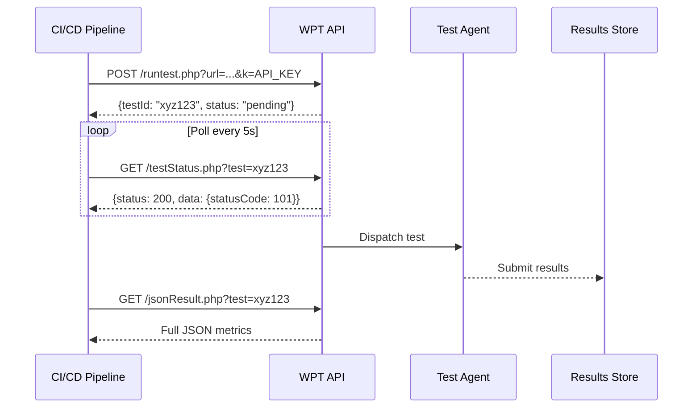

**Category:** Accessibility & Performance Tools
**Difficulty:** Advanced
**Reading time:** 6 min read

---

The WebPageTest API exposes the full power of WebPageTest's browser-based performance testing infrastructure programmatically, enabling CI/CD pipeline integration, automated performance budgeting, and custom monitoring workflows. Teams use it to trigger tests, poll for results, and retrieve structured JSON performance data at any scale.

- **API Key** — authentication token required for API access; free-tier keys have daily test limits
- **Test ID** — unique identifier returned when a test is submitted; used to poll for completion and retrieve results
- **Status Polling** — periodic GET requests to check if a submitted test has completed (API is asynchronous)
- **JSON Results** — structured performance data including all metrics, waterfall data, screenshots, and video frames
- **Custom Metrics** — JavaScript snippets passed to the API that execute in the browser and return custom values in results
- **Script** — multi-step test instructions using WebPageTest's scripting syntax to simulate navigation, form submission, and interactions

The WebPageTest API follows a submit-then-poll pattern because browser tests take 30–120 seconds to complete. You submit a test with parameters: the URL, test location, browser, connection speed, number of runs, and optional advanced settings. The API returns a test ID immediately.

Your code then polls the status endpoint every 5–10 seconds. The status response includes a numeric code: 1xx means queued, 2xx means running, 3xx means awaiting video processing, 200 means complete. Once complete, you retrieve the full JSON results using the test ID.

The JSON response is comprehensive: per-run and median metrics (TTFB, LCP, CLS, SpeedIndex, total byte count, request count), the full HTTP Archive for waterfall reconstruction, screenshot URLs, video frames, and all Lighthouse audit results. Custom metrics you injected run in the browser and appear in a `custom_metrics` object.

For CI/CD integration, the common pattern is: run the test after deploying to a preview environment, compare returned metrics against budget thresholds, and fail the CI check if any threshold is exceeded. Libraries like `webpagetest-api` (Node.js) abstract the polling loop. The `--budget` parameter in the WPT CLI accepts a JSON budget file.

Self-hosted WebPageTest servers expose the same API, allowing unlimited tests without rate limits, custom agent configurations, and testing of internal URLs not reachable from the public network.

- Automated performance budgets in CI — block deploys when LCP or CLS exceeds defined thresholds
- Custom performance dashboards — ingest WPT results into Grafana or custom analytics systems
- Competitive monitoring scripts — run nightly tests against competitor pages and store trends
- Authenticated page testing — use scripting to log in before testing protected pages

| Advantage | Disadvantage |
|-----------|--------------|
| Full programmatic access to real-browser performance data | Asynchronous API requires polling logic |
| Supports complex scripted multi-step tests | Free-tier API key has daily test limits |
| Self-hostable for unlimited private testing | JSON result structure is complex; parsing requires care |
| Most detailed per-request data of any performance testing API | Tests can take 30–120 seconds; not suitable for sub-second CI gates |

- [WebPageTest Performance Testing](webpagetest-performance-testing.md)
- [SpeedCurve Performance Monitoring](speedcurve-performance-monitoring.md)
- [Lighthouse Performance Audit](lighthouse-performance-audit.md)

---
*Part of the [Accessibility & Performance Tools](index.md) category · [Back to Master Index](../../index.md)*
