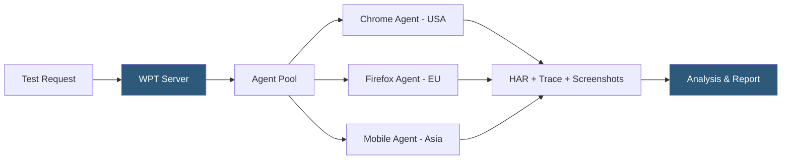

**Category:** Accessibility & Performance Tools
**Difficulty:** Intermediate
**Reading time:** 6 min read

---

WebPageTest is an open-source performance testing tool that runs page load tests from real browsers on real hardware across globally distributed test agents. Unlike simulated lab tools, it provides filmstrip views, waterfall charts, and network-level diagnostics that let engineers trace performance issues to specific requests, third-party scripts, or render-blocking resources.

- **Waterfall Chart** — a timeline showing every HTTP request, its start time, DNS resolution, connection, TTFB, and content download phases
- **Filmstrip** — a series of screenshots taken at 100ms intervals showing the visual progression of the page load
- **TTFB (Time to First Byte)** — the time between the initial request and the server's first byte of response; high TTFB often indicates server or database latency
- **SpeedIndex** — a composite metric measuring how quickly visible page content fills in during load; lower is better
- **Test Agent** — a real machine running a specific browser, OS, and network profile that executes the test
- **Custom Metrics** — JavaScript snippets you inject at test time to capture custom values not in default metrics

WebPageTest operates a global network of test agents — real machines running physical browsers. When you submit a test, you specify a URL, a test location (Dulles, London, Sydney, etc.), a browser, a connection type (Cable, 4G, 3G), and optional test parameters. The WPT server queues your test and dispatches it to an available agent.

The agent opens the browser, loads the page, and captures a multi-layered trace: an HTTP Archive (HAR) file containing every request and response header, a Chrome DevTools timeline trace for CPU and rendering analysis, filmstrip screenshots, and video recording. The test runs three times by default and reports the median result to reduce variance.

The waterfall chart is the diagnostic centerpiece. Each row is one HTTP request, color-coded by phase. A long DNS bar indicates a slow resolver. A long Time to Connect suggests TCP/TLS overhead. A long TTFB points to server processing time. A long content download indicates a large resource or bandwidth constraint. By scanning the waterfall, you can identify which specific request is the bottleneck.

WebPageTest's API allows CI/CD integration: submit a test, poll for completion, and retrieve structured JSON results. The `--budget` flag or custom scripting lets you fail builds when key metrics exceed thresholds. The open-source server code can be self-hosted for private testing or custom agent configurations.

- Third-party script auditing — measure the blocking time contributed by analytics, chat widgets, and ad scripts
- Network condition simulation — test how the site performs on 3G in emerging markets
- Regression testing — compare waterfall charts before and after deployments to find regressions
- CDN performance comparison — run tests from multiple locations to evaluate CDN cache hit rates

| Advantage | Disadvantage |
|-----------|--------------|
| Real browsers on real hardware produce accurate results | Free tier has usage limits and queue wait times |
| Detailed waterfall and filmstrip enable precise diagnosis | Learning curve for interpreting waterfall and trace data |
| Self-hostable for private/custom testing | API rate limits restrict high-frequency monitoring |
| Global test locations reflect geographic performance variation | Test results vary slightly between runs due to real-world conditions |

- [Lighthouse Performance Audit](lighthouse-performance-audit.md)
- [GTmetrix Site Speed Analysis](gtmetrix-site-speed-analysis.md)
- [SpeedCurve Performance Monitoring](speedcurve-performance-monitoring.md)

---
*Part of the [Accessibility & Performance Tools](index.md) category · [Back to Master Index](../../index.md)*
