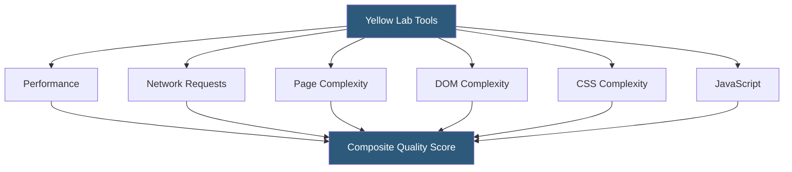

**Category:** Accessibility & Performance Tools
**Difficulty:** Intermediate
**Reading time:** 5 min read

---

Yellow Lab Tools is an open-source web page quality testing tool that runs deep technical analysis beyond standard performance metrics, evaluating JavaScript complexity, DOM size, CSS complexity, and network efficiency. It is particularly useful for front-end developers who want detailed code-quality diagnostics alongside performance measurements.

- **Quality Score** — Yellow Lab's composite score combining performance, network, page quality, DOM/CSS analysis, and JavaScript metrics
- **DOM Complexity** — analysis of document tree depth, total element count, and excessive nesting that degrades rendering performance
- **CSS Complexity** — evaluation of stylesheet size, selector specificity, duplicate rules, and properties that trigger expensive paint operations
- **JavaScript Execution** — measurement of synchronous script execution time, long tasks, and main thread blocking
- **PhantomJS / Headless Chrome** — Yellow Lab uses a headless browser to render the page and collect all metrics
- **Open-Source** — Yellow Lab Tools is freely available on GitHub and can be self-hosted for private testing

Yellow Lab Tools renders the target page in a headless browser while capturing a comprehensive performance trace. Unlike tools focused purely on load times, it performs static analysis on the page's HTML, CSS, and JavaScript after rendering.

The DOM analysis counts total elements, measures nesting depth, identifies deeply nested structures that slow selector matching, and flags hidden elements consuming memory. The CSS analysis parses all loaded stylesheets to count total rules, identify duplicate rules, measure specificity scores, and flag expensive properties like `box-shadow`, `filter`, and `border-radius` applied to frequently painted elements.

The JavaScript module measures main thread blocking time, identifies synchronous scripts, counts global variables, and looks for jQuery usage patterns that cause repeated DOM traversals.

Network analysis covers total requests by type (HTML, CSS, JavaScript, images, fonts, XHR), identifies resources lacking compression, missing cache headers, and opportunities to combine or defer assets.

Being open-source, Yellow Lab can be installed via npm (`npm install -g yellowlabtools`) and run locally against any URL including localhost or staging environments. The JSON output integrates well with custom reporting scripts.

- Front-end code quality audits — identify CSS specificity wars, JS global namespace pollution, or excessive DOM nesting
- Legacy site assessment — comprehensive quality baseline before starting a refactoring project
- Self-hosted private testing — run against internal staging environments without exposing code to third-party services
- Custom quality reporting — process JSON output to generate reports tailored to specific engineering standards

| Advantage | Disadvantage |
|-----------|--------------|
| Deep CSS and DOM complexity analysis not available in Lighthouse | Less actively maintained than major commercial tools |
| Fully open-source and self-hostable | Results not aligned with Core Web Vitals (which is what Google uses) |
| Free with no usage limits when self-hosted | Smaller community and less documentation |
| npm installable for easy local integration | PhantomJS (original engine) is deprecated; newer versions use Headless Chrome |

- [Lighthouse Performance Audit](lighthouse-performance-audit.md)
- [WebPageTest Performance Testing](webpagetest-performance-testing.md)
- [GTmetrix Site Speed Analysis](gtmetrix-site-speed-analysis.md)

---
*Part of the [Accessibility & Performance Tools](index.md) category · [Back to Master Index](../../index.md)*
