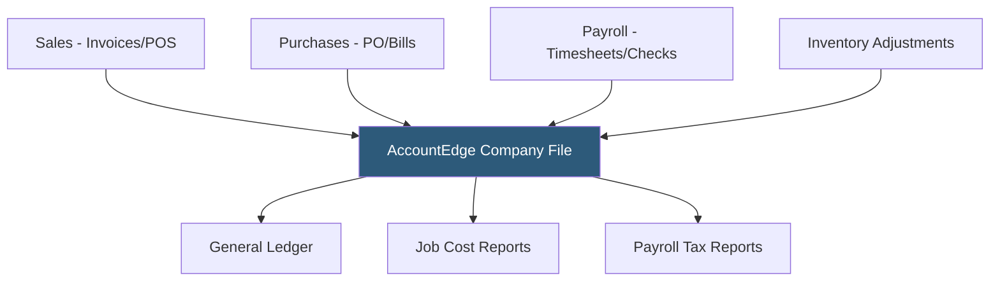

**Category:** Accounting Software Platforms
**Difficulty:** Intermediate
**Reading time:** 4 min read

---

AccountEdge is a desktop-based small business accounting application for Mac and Windows developed by Acclivity (formerly MYOB US), serving product-based businesses that need inventory management, payroll, and job tracking without moving to a cloud subscription model. It occupies the same market position as QuickBooks Desktop for businesses preferring perpetual-license desktop software.

- **Perpetual license** — AccountEdge is sold as a one-time purchase with an optional annual maintenance plan for updates, rather than a monthly subscription
- **Inventory management** — item-based inventory with average cost or FIFO valuation, purchase orders, and reorder point alerts
- **Payroll module** — US and Canadian payroll processing with tax table subscriptions, direct deposit integration, and W-2/T4 generation
- **Job tracking** — project-based cost tracking that allocates income and expenses to specific jobs for profitability analysis
- **AccountEdge Connect** — the optional cloud companion app allowing remote invoice creation and expense entry that syncs back to the desktop installation

AccountEdge stores all company data in a local company file on the user's computer or a network server. Multiple users access the same company file over a local area network using AccountEdge Network Edition. The desktop application processes all transactions locally without requiring an internet connection, which appeals to businesses with unreliable connectivity or strict data residency requirements.

Sales processing covers quotes, orders, invoices, and receipts with optional retail point-of-sale using a connected cash drawer and receipt printer. Inventory tracks item quantities by location, with purchase orders triggering received goods entries that update stock levels and average costs. The payroll module calculates federal, state, and local taxes using annually-updated tax tables available through Acclivity's subscription service.

AccountEdge Connect adds cloud functionality selectively: sales staff can create invoices and record payments on mobile devices, which sync to the desktop installation at day's end. This hybrid approach preserves the desktop foundation while extending accessibility to field staff.

- Mac-based small business needing a perpetual-license desktop accounting solution as an alternative to QuickBooks Desktop for Mac
- Small manufacturer or distributor needing inventory management and purchase orders without a cloud ERP subscription
- Business with payroll under 25 employees managing payroll in-house with the built-in payroll module
- Retail store using the POS integration with inventory tracking for product-based sales

| Advantage | Disadvantage |
|-----------|--------------|
| Perpetual license eliminates recurring subscription cost for stable businesses | Desktop-first model limits remote access compared to cloud-native alternatives |
| Strong Mac support fills a gap where QuickBooks Desktop for Mac was discontinued | Annual tax table subscription required for payroll; no ongoing development beyond maintenance |
| Local data file gives complete control over data without vendor cloud dependency | Smaller development team means slower feature updates than cloud platform competitors |

- [QuickBooks Desktop Pro](quickbooks-desktop-pro.md)
- [Sage 50cloud Accounting](sage-50cloud-accounting.md)
- [QuickBooks Desktop Premier](quickbooks-desktop-premier.md)

---
*Part of the [Accounting Software Platforms](index.md) category · [Back to Master Index](../../index.md)*
