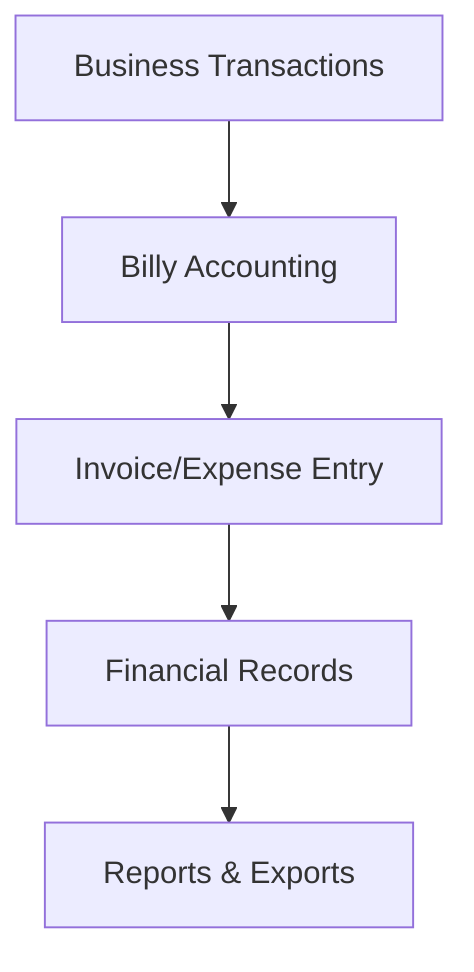

**Category:** Accounting Software Platforms
**Difficulty:** Intermediate
**Reading time:** 6 min read

---

Billy is a cloud accounting software platform designed for small businesses and freelancers. It provides invoicing, expense tracking, financial reporting, and tax compliance features in an easy-to-use interface.

- **Invoicing** — creating and sending invoices
- **Expense Tracking** — recording business expenses
- **Bank Integration** — automatic transaction import
- **Tax Reports** — generating tax documents
- **Multi-currency** — handling international transactions

Billy provides cloud-based accounting designed for simplicity. Users create invoices with customizable templates and send them to clients. The system tracks unpaid invoices and sends reminders. Bank accounts connect automatically to import transactions daily. Expenses are categorized for tax purposes. Billy generates standard financial reports including profit & loss, balance sheet, and cash flow. Tax reports compile the data needed for filing. Multi-currency support handles international invoicing and currency conversion. Users export financial data for accountants or tax professionals. Mobile app allows invoicing and expense entry on the go.

- Managing invoices for service businesses
- Tracking expenses for tax deductions
- Generating financial statements
- Filing quarterly/annual tax returns
- Managing multiple currencies

| Advantage | Disadvantage |
|-----------|--------------|
| Simple interface | Limited customization |
| Affordable pricing | Fewer advanced features |
| Good for freelancers | Not enterprise-grade |
| Mobile-friendly | Limited integrations |
| Cloud-based | Less mature platform |

- [Akaunting open-source accounting](akaunting-open-source-accounting.md)
- [GnuCash free accounting](gnucash-free-accounting.md)
- [Manager.io accounting software](managerio-accounting-software.md)

---
*Part of the [Accounting Software Platforms](accounting-software-platforms/index.md) category · [Back to Master Index](../../index.md)*
