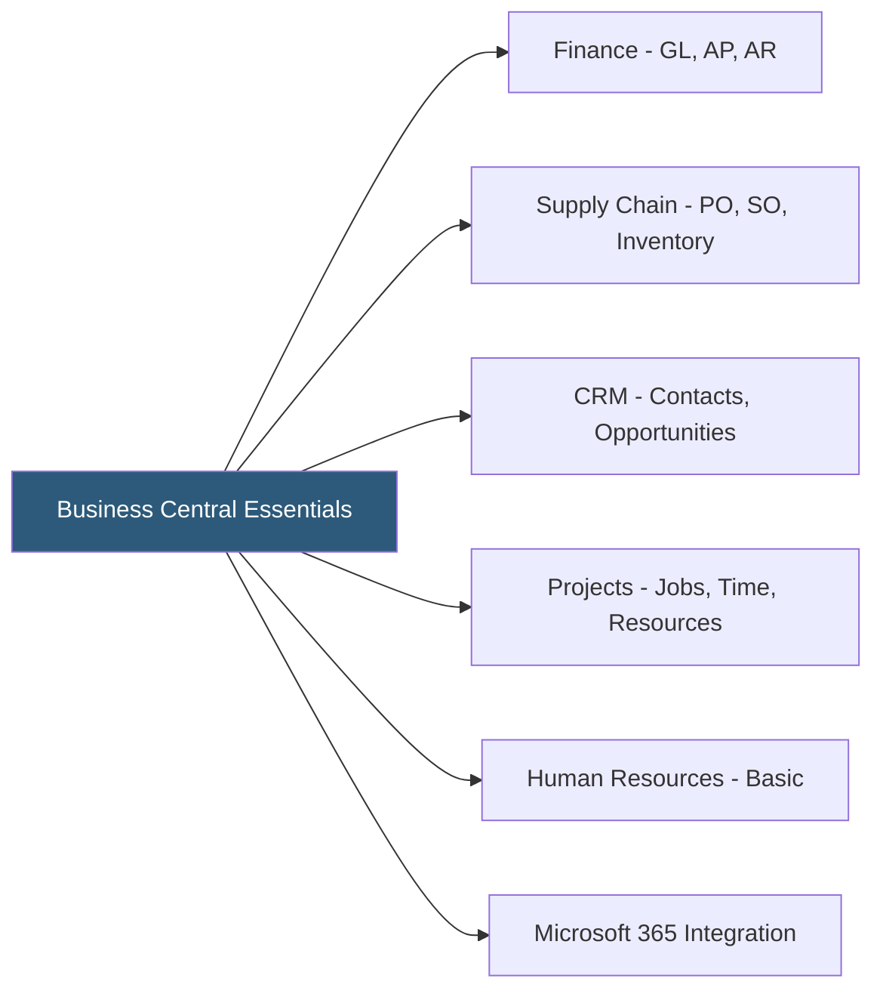

**Category:** Accounting Software Platforms
**Difficulty:** Intermediate
**Reading time:** 5 min read

---

Business Central Essentials is the base licensing tier for Microsoft Dynamics 365 Business Central, covering financial management, supply chain, CRM, and project management for an unlimited number of team members at the Essentials per-user monthly fee. It is the starting point for most Business Central implementations that do not require manufacturing capabilities.

- **Named user licensing** — Business Central Essentials licenses are purchased per named user per month; each user requires a separate license
- **Team Member license** — a lower-cost read-only license for staff who need to view reports or enter limited data (timesheets, expense reports) without full transactional access
- **Financial management** — the core accounting module including GL, AR, AP, fixed assets, bank reconciliation, and cash flow forecasting
- **Supply chain** — inventory management, purchase orders, sales orders, and warehouse management included in Essentials
- **Project management** — time sheets, resource allocation, job costing, and project invoicing available within Essentials

Essentials licensing is per named user per month (approximately $70/user/month as of 2024 for cloud). The license covers full access to all Essentials module areas — finance, supply chain, project management, and CRM. Users with read-only or limited data entry needs can be licensed with Team Member licenses at approximately $8/user/month, significantly reducing licensing costs for large organizations with many occasional users.

The Essentials tier includes Microsoft's standard set of capabilities without manufacturing-specific modules (production orders, machine centers, capacity planning, quality management). Businesses with light assembly operations can use the Assembly Management feature within Essentials to handle component-to-finished-goods assembly, but full MRP and work-order-based manufacturing requires the Premium license.

Essentials includes the full Business Central API, Power Platform connectors, and AppSource extension support. Third-party industry extensions from AppSource (construction management, professional services automation, retail, non-profit) run on Essentials without requiring Premium.

- Distribution company needing supply chain and financial management without manufacturing capabilities
- Professional services firm managing projects, time tracking, and client invoicing with 15 full users and 30 read-only managers
- Non-profit organization using an AppSource non-profit extension on top of Essentials for fund accounting
- Small business migrating from QuickBooks Advanced seeking ERP capabilities at a per-user pricing model

| Advantage | Disadvantage |
|-----------|--------------|
| Includes supply chain and project management not in SMB accounting tools | Per-user pricing makes total cost difficult to predict for growing organizations |
| Team Member license reduces cost for large organizations with many occasional users | Manufacturing capabilities require Premium license upgrade |
| Full AppSource marketplace access enables industry-specific extensions | Implementation partner fees often exceed first-year licensing costs |

- [Business Central Premium](business-central-premium.md)
- [Microsoft Dynamics 365 Business Central](microsoft-dynamics-365-business-central.md)
- [NetSuite ERP Financials](netsuite-erp-financials.md)

---
*Part of the [Accounting Software Platforms](index.md) category · [Back to Master Index](../../index.md)*
