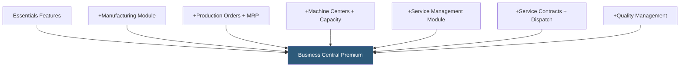

**Category:** Accounting Software Platforms
**Difficulty:** Advanced
**Reading time:** 5 min read

---

Business Central Premium adds manufacturing and service management capabilities to the Essentials feature set, enabling businesses with production operations and field service requirements to manage the full product lifecycle — from raw materials procurement through production and service delivery — in a single platform.

- **Production orders** — work orders that define what to produce, in what quantity, using which components and operations, driving material consumption and labor cost capture
- **MRP (Material Requirements Planning)** — automated calculation of raw material requirements based on sales demand and production schedules, generating replenishment purchase orders
- **Machine centers and work centers** — capacity planning units representing production resources, used to schedule production operations and track capacity utilization
- **Service management** — service contracts, service orders, service item tracking, and technician dispatch for field service and repair operations
- **Quality management** — quality control checkpoints during receiving and production, with non-conformance recording and corrective action workflows

Business Central Premium's manufacturing module handles multi-level bills of materials (BOMs) where finished goods are made from sub-assemblies that are in turn made from raw materials. The MRP planning engine calculates net requirements by comparing demand (from sales orders and production orders) against supply (on-hand inventory, open purchase orders, open production orders) and suggests replenishment orders to fill gaps.

Production orders track the transformation of raw materials through production operations into finished goods. As operations are completed, workers record actual time (via the production journal) and actual material consumption (via the production journal or barcode scanning). The difference between standard/expected costs and actual costs is recorded as a production variance, enabling manufacturing cost analysis.

Service management handles the service lifecycle: equipment is registered as service items with serial numbers and service histories; service contracts define recurring maintenance schedules and warranty coverage; service orders manage specific repair jobs from customer request through technician dispatch, parts consumption, and invoicing.

- Light manufacturer using production orders and MRP to plan weekly production schedules and raw material procurement
- Equipment manufacturer tracking service contracts and field service dispatch for installed equipment
- Food manufacturer tracking production runs with lot tracking from raw ingredients through finished goods for recall preparedness
- Machine shop managing capacity across 10 CNC machines with scheduling based on work center capacity

| Advantage | Disadvantage |
|-----------|--------------|
| Full manufacturing and service management in the same platform as accounting | Premium per-user cost (approximately $100/user/month) significantly higher than Essentials |
| MRP automates production planning that would otherwise require manual spreadsheet analysis | Manufacturing module complexity requires significant training and implementation investment |
| Multi-level BOM handles complex product structures with subassemblies | Not suitable for process manufacturing (chemicals, food & beverage at scale); best for discrete manufacturing |

- [Business Central Essentials](business-central-essentials.md)
- [Microsoft Dynamics 365 Business Central](microsoft-dynamics-365-business-central.md)
- [Sage 100cloud](sage-100cloud.md)

---
*Part of the [Accounting Software Platforms](index.md) category · [Back to Master Index](../../index.md)*
